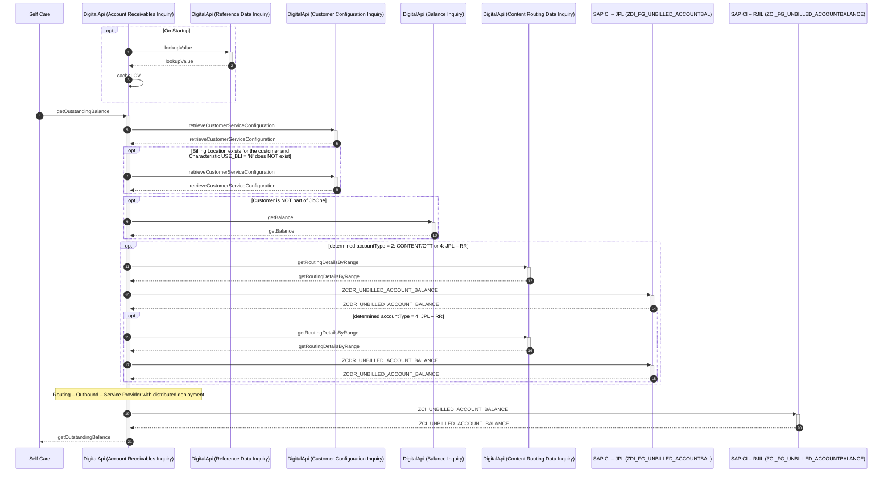

# Account Receivables Inquiry

## getOutstandingBalance

| Service Characteristics | Values |
| --- | --- |
| **Service Name** | Account Receivables Inquiry |
| **Operation Name** | getOutstandingBalance |
| **Provider** | <ul style="list-style-type: disc;"><li>SAP CI – RJIL</li><li>SAP CI – JPL</li><li>SAP CI – JPL – RR</li><li>SAP HANA (Routing DB) via. Routing Data Inquiry:getRoutingDetails</li><li>DigitalApi Platform Database via. Content Routing Data Inquiry:getRoutingDetailsByRange</li><li>OCS, SAP HANA (Routing DB) via. Balance Inquiry:getBalance</li><li>EDIF, SAP CRM via. Customer Configuration Inquiry:retrieveCustomerServiceConfiguration</li><li>EDIF via. Reference Data Inquiry: lookupValue</li></ul> |
| **Consumer** | <ul style="list-style-type: disc;"><li>RPOS</li><li>MyJio</li><li>Self Care</li><li>JPW</li><li>JioAssist</li><li>DigitalApi Platform</li><ul style="list-style-type: circle;padding-left: 15px;"><li>Number Portability Management Number Validation:receiveMessage</li></ul></ul> |
| **Data Format** | Reliance SID |
| **Protocol / Transport** | <ul style="list-style-type: disc;"><li>JSON/HTTP</li><ul style="list-style-type: circle;padding-left: 15px;"><li>RPOS</li><li>MyJio</li><li>Self Care</li><li>JPW</li><li>JioAssist</li><li>DigitalApi Platform</li></ul></ul> |
| **Mediation Pattern** | Service Translator |
| **Interaction Type** | Synchronous read request |

### Interaction Diagram



Following is a textual walk-through of the approach to implement Account Receivables Inquiry: getOutstandingBalance operation.

1.  On Startup, Account Receivables Inquiry Component invokes [lookupValue](../../common/Manage Reference Data/Reference Data Inquiry.md#lookupvalue) operation of [Reference Data Inquiry](../../common/Manage Reference Data/Reference Data Inquiry.md) Service to fetch the LOV for Tax percentage for the State.  
    **Note:** specify LOV Type: PROD_STATE_TAX

2.  Account Receivables Inquiry component caches the Tax percentage for the State  
    **Note:** Code indicates the State Code and Name indicates the Tax Percentage

3.  Service Consumer (e.g. Self Care) invokes getOutstandingBalance operation of Account Receivables Inquiry service to get the outstanding balance.

4.  On receiving the request, Account Receivables Inquiry component invokes [retrieveCustomerServiceConfiguration](../../inventory/Manage Customer Information/Customer Configuration Inquiry.md#retrievecustomerserviceconfiguration) operation of [Customer Configuration Inquiry](../../inventory/Manage Customer Information/Customer Configuration Inquiry.md) service to retrieve Account ID(s) and Collection Agency, if available.  
    **Note:** If Account ID is received in request, specify /customerAccount/accountId = </accountId\>, filterKey = <PRODACCT\>  
    **Note:** If Customer ID is received in request, specify /customerID = </customerId\>, filterKey = <PRODACCT\>  
    **Note:** Collection Agency is identified based on /customer/characteristics[name = 'Z00100']/value
	```title="Note:"
	If Customer is part of JioOne (identified by /customer/segment[name = '46']/value = '120001' exist)
        set jioOneCustomer = true
	otherwise
	    set jioOneCustomer = false
	```

    **Note:** productStateCode is identified by /customer/product[1]/characteristics[name = 'PRODUCT_STATE']/value  
    **Note:** rjilAccountId is identified by /customer/customerAccount[accountType = '1']/accountId  
    **Note:** jplAccountId is identified by /customer/customerAccount[accountType = '2']/accountId  
    **Note:** jplrrAccountId is identified by /customer/customerAccount[accountType = '4']/accountId

5.  If Billing Location exists for the customer and Characteristic USE_BLI = 'N' does NOT exist (identified from response of retrieveCustomerServiceConfiguration; /customer/characteristics[name = 'CRMH04']/value exists and /characteristics[name = 'USE_BLI']/value = 'N' does NOT exist)  
    **Note:** Characteristic USE_BLI = 'N' is specified to NOT use the Billing Location, if exists

    1.  Account Receivables Inquiry component invokes [retrieveCustomerServiceConfiguration](../../inventory/Manage Customer Information/Customer Configuration Inquiry.md#retrievecustomerserviceconfiguration) operation of [Customer Configuration Inquiry](../../inventory/Manage Customer Information/Customer Configuration Inquiry.md) service to retrieve Account ID(s) and Collection Agency for the Billing Location.  
        **Note:** specify /customerID = <from response of retrieveCustomerServiceConfiguration; /customer/characteristics[name = 'CRMH04']/value\>, filterKey = <ACCOUNT\>  
        **Note:** Collection Agency is identified based on /customer/characteristics[name = 'Z00100']/value  
        **Note:** Account details of Billing Location are used for further processing

6.  Account Receivables Inquiry component identifies the 'applicable' Account Id – RJIL or JPL or JPL – RR for the received request:  
    **Note:** Account details are returned for the identified 'applicable' account

    1.  if Collection Agency = JPL – RR (identified by /customer/characteristics[name = 'Z00100']/value = 'Z00095')
        -   accountType = 4: JPL – RR
        -   accountId = as retrieved from retrieveCustomerServiceConfiguration /customer/customerAccount[accountType = '4']/accountId

    2.  else if Collection Agency = JPL or (Collection Agency doesn't exists and Account ID – JPL is retrieved) (identified by /customer/characteristics[name = 'Z00100']/value = 'Z00094' or (/customer/characteristics[name = 'Z00100'] does NOT exists and /customer/customerAccount[accountType='2']/accountId exists))
        -   accountType = 2: CONTENT/OTT
        -   accountId = as retrieved from retrieveCustomerServiceConfiguration /customer/customerAccount[accountType = '2']/accountId

    3.  Otherwise
        -   accountType = 1: CONNECTIVITY
        -   accountId = as retrieved from retrieveCustomerServiceConfiguration /customer/customerAccount[accountType = '1']/accountId

7.  If Customer is NOT part of JioOne (jioOneCustomer = false)  
    **Note:** Unbilled Outstanding is NOT applicable for JioOne Customers

    1.  Account Receivables Inquiry component invokes [getBalance](../Manage Balance/Balance Inquiry.md#getbalance) operation of [Balance Inquiry](../Manage Balance/Balance Inquiry.md) service to retrieve the monetary balance for an account and products.  
        **Note:** specify accountID = <rjilAccountId\>, filterKey = <MONETARY\>  
        **Note:** Unbilled Amount of RJIL is determined from /customerBillingCreditDetails/unbilledUsageAmount

8.  If determined accountType = 2: CONTENT/OTT or 4: JPL – RR

    1.  Account Receivables Inquiry component invokes [getRoutingDetailsByRange](../../../digital/common/Manage Content Reference Data/Content Routing Data Inquiry.md#getroutingdetailsbyrange) operation of [Content Routing Data Inquiry](../../../digital/common/Manage Content Reference Data/Content Routing Data Inquiry.md) service to retrieve the transaction routing details (Endpoint URL) for the destination instance of SAP CI – JPL.  
        **Note:** specify /routingData/serviceProvider = <specify 02: SAP CI – JPL\>, /characteristics[name='ACCOUNT_ID']/value = <as retrieved from retrieveCustomerServiceConfiguration /customer/customerAccount[accountType='2']/accountId\>

    2.  Account Receivables Inquiry component translates the request from CMM (Reliance SID) message to the proprietary message model of SAP and invoke the RFC ZCDR_UNBILLED_ACCOUNT_BALANCE of SAP CI – JPL.  
	    **Note:** specify IV_ACCOUNT_ID = as retrieved from retrieveCustomerServiceConfiguration; /customer/customerAccount[accountType='2']/accountId
		
		```title="Note:"
		Unbilled Outstanding is NOT supported for JioOne. Unbilled Outstanding is applicable for Individual 
		Customer or when JioFiber, JioAirFiberMU or JioAirFiberUBR Customer continues to remain linked 
		with the Billing Location after Exit JioOne.
		
		SAP CI determines and returns Unbilled Outstanding when:
		    # received value of IV_ACCOUNT_ID is for individual customer
			# received value of IV_ACCOUNT_ID is for Billing Location and NOT part of JioOne (identified by
			    ZPRDID IN [P10005 | P10056 | P10055] (configurable)) 
		```
		
    3.  If determined accountType = 4: JPL – RR

        1.  Account Receivables Inquiry component invokes [getRoutingDetailsByRange](../../../digital/common/Manage Content Reference Data/Content Routing Data Inquiry.md#getroutingdetailsbyrange) operation of [Content Routing Data Inquiry](../../../digital/common/Manage Content Reference Data/Content Routing Data Inquiry.md) service to retrieve the transaction routing details (Endpoint URL) for the destination instance of SAP CI – JPL – RR.  
            **Note:** specify /routingData/serviceProvider = <specify 09: SAP CI – JPL – RR\>, /characteristics[name = 'ACCOUNT_ID']/value = <as retrieved from retrieveCustomerServiceConfiguration /customer/customerAccount[accountType='4']/accountId\>.

        2.  Account Receivables Inquiry component translates the request from CMM (Reliance SID) message to the proprietary message model of SAP and invoke the RFC ZCDR_UNBILLED_ACCOUNT_BALANCE of SAP CI – JPL – RR.  
		    
			**Note:** specify IV_ACCOUNT_ID = as retrieved from retrieveCustomerServiceConfiguration; /customer/customerAccount[accountType = '4']/accountId,

    4.  On receiving response from SAP CI, Account Receivables Inquiry component translates the message from the proprietary message model of SAP to the CMM (Reliance SID).

9.  Account Receivables Inquiry component retrieves the transaction routing details (Endpoint URL) for the destination instance of SAP CI – RJIL. Refer [Routing – Outbound – Service Component to route](../../appendices/Appendix G.md#routing-outbound-service-component-to-route) for details.  
    **Note:** If routingZoneID is retrieved from invocation of Customer Configuration Inquiry: retrieveCustomerServiceConfiguration, use the same value of Routing Zone for determining the destination instance of SAP CI – RJIL, otherwise use the determined accountId (as retrieved from retrieveCustomerServiceConfiguration /customer/customerAccount[accountType = '1']/accountId) for determining the destination instance of SAP CI – RJIL.

10.  Account Receivables Inquiry component translates the request from CMM (Reliance SID) message to the proprietary message model of SAP and invoke the RFC ZCI_UNBILLED_ACCOUNT_BALANCE of SAP CI – RJIL.  
    **Note:** specify IV_ACCOUNT_ID = as retrieved from retrieveCustomerServiceConfiguration; /customer/customerAccount[accountType = '1']/accountId

11.  On receiving response from SAP CI, Account Receivables Inquiry component translates the message from the proprietary message model of SAP to the CMM (Reliance SID).

12.  If Unbilled outstanding amount \> 0 (identified by /customer/account/totalBalance/balance[type = '2']/outstandingAmount \> 0)

    1.  Account Receivables Inquiry component performs a lookup for the LOV PROD_STATE_TAX to retrieve tax percentage, data for which is cached on startup, based on the productStateCode.

    2.  Account Receivables Inquiry component iterates through balanceDetails (identified by /customer/account/totalBalance/balance[type = '2']/balanceDetails

        1.  If /balanceDetails[i]/outstandingAmount \> 0,
            -   specify outstandingAmount (roundoff to 2 decimal places) = outstandingAmount + (outstandingAmount * tax percentage)
            -   totalOutstanding = totalOutstanding + outstandingAmount

    3.  Account Receivables Inquiry component updates
        -   /customer/account/totalBalance/balance[type = '2']/outstandingAmount = totalOutstanding
        -   /customer/account/totalBalance/outstandingAmount = totalOutstanding + /customer/account/totalBalance/balance[type = '1']/outstandingAmount

13.  Account Receivables Inquiry component returns the response to the invoking component.


## **Additional details**
[Refer to mapping sheet for list of data elements](https://jio.ril.com/sites/systems/design/Shared%20Documents/04.%20E2E%20Architecture%20and%20Solutions/02.%20Macro%20Design%20Documents/Functional%20Mappings/AccountReceivablesInquiry.xls?Web=1)  
[Refer to Developer Portal for specifications](https://digitalapi.developers.jio.com/api/66)

### Change log

