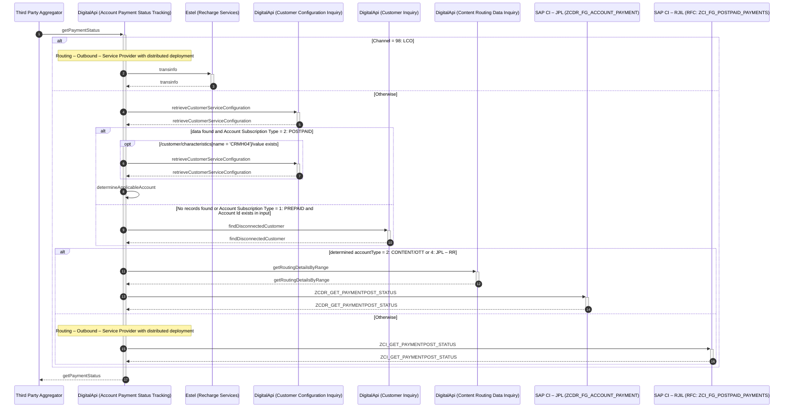
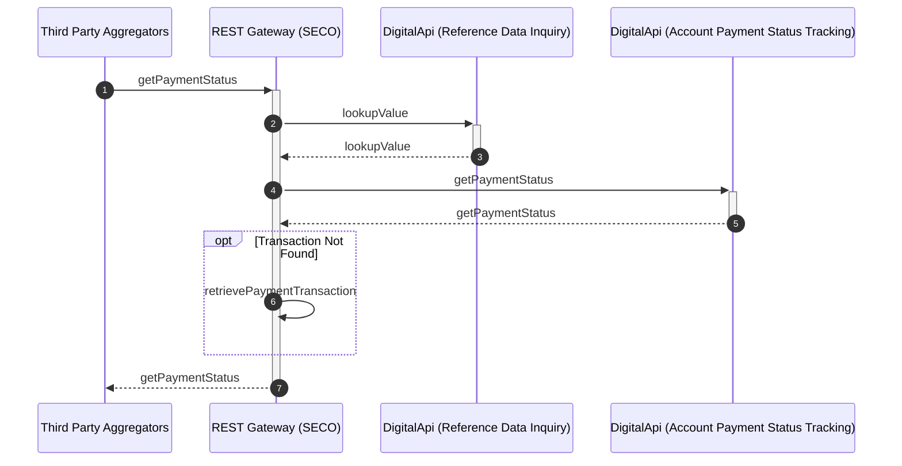

# Account Payment Status Tracking

## getPaymentStatus

| Service Characteristics | Values |
| --- | --- |
| **Service Name** | Account Payment Status Tracking |
| **Operation Name** | getPaymentStatus |
| **Provider** | <ul style="list-style-type: disc;"><li>Estel</li><li>SAP CI – RJIL</li><li>SAP HANA (Routing DB) via. Routing Data Inquiry:getRoutingDetails</li><li>SAP CI – JPL</li><li>SAP CI – JPL – RR</li><li>DigitalApi Platform Database via. Content Routing Data Inquiry:getRoutingDetailsByRange</li><li>SAP CI – RJIL, SAP CI – JPL, SAP CI – JPL – RR via. Customer Inquiry:findDisconnectedCustomer</li></ul> |
| **Consumer** | <ul style="list-style-type: disc;"><li>Third Party Aggregators</li><li>Jio Money</li></ul> |
| **Data Format** | Reliance SID |
| **Protocol / Transport** | <ul style="list-style-type: disc;"><li>SOAP/HTTP</li><ul style="list-style-type: circle;padding-left: 15px;"><li>Jio Money</li></ul><li>JSON/HTTP</li><ul style="list-style-type: circle;padding-left: 15px;"><li>Third Party Aggregators</li></ul></ul> |
| **Mediation Pattern** | Service Translator |
| **Interaction Type** | Synchronous read request |

### Interaction Diagram

Following is a textual walk-through of the approach to implement Account Payment Status Tracking:getPaymentStatus operation.

1.  Service Consumer invokes getPaymentStatus operation of Account Payment Status Tracking service to get the status of Payment request.

2.  On receiving the request, Account Payment Status Tracking component evaluates the Channel

3.  If Channel = 98: LCO  
    **Note:** List of channels is configurable.

    1.  Account Payment Status Tracking component retrieves the transaction routing details (Endpoint URL) for the destination instance of Estel. Refer [Routing – Outbound – Service Component to route](../../appendices/Appendix G.md#routing-outbound-service-component-to-route) for details.

    2.  Account Payment Status Tracking component translates the request from CMM (Reliance SID) message to the proprietary message model of Estel and invoke the transinfo operation of the Estel interface (Protocol / Transport = SOAP/HTTP) to retrieve the payment status.

    3.  On receiving response from Estel, Account Payment Status Tracking component translates the message from the proprietary message model of Estel to the CMM (Reliance SID)

4.  Otherwise

    1.  Account Payment Status Tracking component invokes [retrieveCustomerServiceConfiguration](../../inventory/Manage Customer Information/Customer Configuration Inquiry.md#retrievecustomerserviceconfiguration) operation of [Customer Configuration Inquiry](../../inventory/Manage Customer Information/Customer Configuration Inquiry.md) service to retrieve Account ID(s) and Collection Agency, if available.  
        **Note:** If Account ID is received in request, specify /customerBill/CustomerAccount/accountID = </customerAccount/accountID\>, filterKey = <ACCOUNT\>  
        **Note:** If Service ID is received in request, specify /identifier/value = </product/Identifier/value\>, /identifier/subcategory = <2\>, filterKey = <ACCOUNT\>  
        **Note:** Collection Agency is identified based on /customer/characteristics[attributeName = 'Z00100']/attributeValue.

    2.  If data found (identified by /resultStatus/status = 'SUCCESS') and Account Subscription Type = 2: POSTPAID (identified by /customer/customerAccount[1]/subscriptionType = '2'), Account Payment Status Tracking component identifies the "applicable" Account Id – RJIL or JPL or JPL – RR for the received request:  
        **Note:** request is routed based on the collection agency

        1.  If Billing Location exists for the customer (identified from response of retrieveCustomerServiceConfiguration; /customer/characteristics[name = 'CRMH04']/value exists)
            -   Account Payment Status Tracking component invokes [retrieveCustomerServiceConfiguration](../../inventory/Manage Customer Information/Customer Configuration Inquiry.md#retrievecustomerserviceconfiguration) operation of [Customer Configuration Inquiry](../../inventory/Manage Customer Information/Customer Configuration Inquiry.md) service to retrieve Account ID(s) and Collection Agency for the Billing Location.  
                **Note:** specify /customerID = <from response of retrieveCustomerServiceConfiguration; /customer/characteristics[name = 'CRMH04']/value\>, filterKey = <ACCOUNT\>  
                **Note:** Collection Agency is identified based on /customer/characteristics[name = 'Z00100']/value  
                **Note:** Account details of Billing Location are used for further processing

        2.  if Collection Agency = JPL – RR (identified by /customer/characteristics[attributeName = 'Z00100']/attributeValue = 'Z00095')
            -   accountType = 4: JPL - RR
            -   accountId = as retrieved from retrieveCustomerServiceConfiguration /customer/CustomerAccount[accountType='4']/accountID

        3.  else if Collection Agency = JPL or (Collection Agency doesn't exists and Account ID – JPL is retrieved and Customer is NOT a Billing Location) (identified by /customer/characteristics[attributeName = 'Z00100']/attributeValue = 'Z00094' or (/customer/characteristics[attributeName = 'Z00100'] does NOT exists and /customer/CustomerAccount[accountType='2']/accountID exists and /customer/segment[attributeName='CUSTOMER_CATEGORY']/attributeValue != '0007'))  
            **Note:** Caters to scenario of Payment made for Enterprise Customers through Third Party Aggregator; condition for existence check of Account Id – JPL is applicable only for retail Customers.
            -   accountType = 2: CONTENT/OTT
            -   accountId = as retrieved from retrieveCustomerServiceConfiguration /customer/CustomerAccount[accountType='2']/accountID

        4.  Otherwise
            -   accountType = 1: CONNECTIVITY
            -   accountId = as retrieved from retrieveCustomerServiceConfiguration /customer/CustomerAccount[accountType='1']/accountID

    3.  If (No data found (identified by error code = 7000: No records found) or Account Subscription Type = 1: PREPAID (identified by /customer/CustomerAccount/subscriptionType = 1: PREPAID) and Account Id exists in input (identified by /customerAccount/accountID exists),  
        **Note:** Caters to scenario of Payment Status made for Disconnected Customers through Third Party Aggregator.  
        **Note:** Caters to the scenario for reuse of JPL – RR Account Id also for the RJIL Prepaid Account ID. In an event of Disconnected Postpaid Customer making payment and same Account Id identifies the Pre-paid Customer resulting in incorrect routing; the Pre-paid Account Id is treated same as no record found.

        1.  Account Payment Status Tracking component invokes [findDisconnectedCustomer](../../inventory/Manage Customer Information/Customer Inquiry.md#finddisconnectedcustomer) operation of [Customer Inquiry](../../inventory/Manage Customer Information/Customer Inquiry.md) service to retrieve the details of the permanently disconnected customer.  
            **Note:** specify /customer/CustomerAccount/id = </customerAccount/accountID\>

        2.  "Applicable" Account Id and Account Type is returned in response
            -   accountType = as retrieved from findDisconnectedCustomer /customer/CustomerAccount/accountType
            -   accountId = as retrieved from findDisconnectedCustomer /customer/CustomerAccount/id

    4.  If determined accountType = 2: CONTENT/OTT or 4: JPL – RR

        1.  Account Payment Status Tracking component invokes [getRoutingDetailsByRange](../../../digital/common/Manage Content Reference Data/Content Routing Data Inquiry.md#getroutingdetailsbyrange) operation of [Content Routing Data Inquiry](../../../digital/common/Manage Content Reference Data/Content Routing Data Inquiry.md) service to retrieve the transaction routing details (Endpoint URL) for the destination instance of SAP CI – JPL or SAP CI – JPL – RR.  
            **Note:** specify /routingData/serviceProvider = <if determined accountType = 4: JPL – RR, specify 09: SAP CI – JPL – RR; otherwise specify 02: SAP CI – JPL\>, /characteristics[name='ACCOUNT_ID']/value = <determined accountId\>.

        2.  Account Payment Status Tracking component replaces the Account Id in the request message with the determined accountId (Account ID – JPL or Account Id – JPL – RR).

        3.  Account Payment Status Tracking component translates the request from CMM (Reliance SID) message to the proprietary message model of SAP and invoke the RFC ZCDR_GET_PAYMENTPOST_STATUS of SAP CI – JPL or SAP CI – JPL – RR.

        4.  On receiving response from SAP CI, Account Payment Status Tracking component translates the message from the proprietary message model of SAP to the CMM (Reliance SID).

    5.  Otherwise

        1.  Account Payment Status Tracking component retrieves the transaction routing details (Endpoint URL) for the destination instance of SAP CI. Refer [Routing – Outbound – Service Component to route](../../appendices/Appendix G.md#routing-outbound-service-component-to-route) for details.  
            **Note:** specify determined accountId, if exists

        2.  Account Payment Status Tracking component translates the message from CMM (Reliance SID) to the proprietary message model of SAP and invokes SAP CI RFC ZCI_GET_PAYMENTPOST_STATUS to retrieve the payment status.  
            **Note:** specify determined accountId, if exists

        3.  On receiving response from SAP CI, Account Payment Status Tracking component translates the message from the proprietary message model of SAP to the CMM (Reliance SID).

5.  Account Payment Status Tracking component returns the status to the invoking component.

##Partner-v5-getPaymentStatus

### Interaction Diagram

Following is a textual walk-through of Partner-v5-getPaymentStatus API.

1.  Upon receiving the request for Payment Status, REST Gateway invokes [lookupValue](../../common/Manage Reference Data/Reference Data Inquiry.md#lookupvalue) operation of the [Reference Data Inquiry](../../common/Manage Reference Data/Reference Data Inquiry.md) service to retrieve the Channel Code based on the Relationship subtype as retrieved from OIAM.  
    **Note:** Use LOV Type "RELATIONSHIPSUBTYPE-DM".  
    **Note:** Cache the lookup to avoid lookup for each invocation.

2.  REST Gateway invokes [getPaymentStatus](#getpaymentstatus) operation of [Account Payment Status Tracking](#account-payment-status-tracking) service.  
    **Note:** Specify the Routing Zone (Name=jiodealerroute) as a HTTP header property as received in the request. Refer to Caching Approach for Routing for details.

3.  In case the error returned is "Transaction Not Found", REST Gateway retrieves the Account Payment Transaction from the intermediate data-store which is used for Replay prevention.  
    **Note:** If the record is available in the intermediate data-store, the error message is changed to "Transaction Pending Processing".

4.  The response is then returned to invoking component.

## **Additional details**
[Refer to mapping sheet for list of data elements](https://jio.ril.com/sites/systems/design/Shared%20Documents/04.%20E2E%20Architecture%20and%20Solutions/02.%20Macro%20Design%20Documents/Functional%20Mappings/AccountPaymentStatusTracking.xls?Web=1)  
[Refer to Developer Portal for specifications](https://digitalapi.developers.jio.com/api/95)

### Change log
