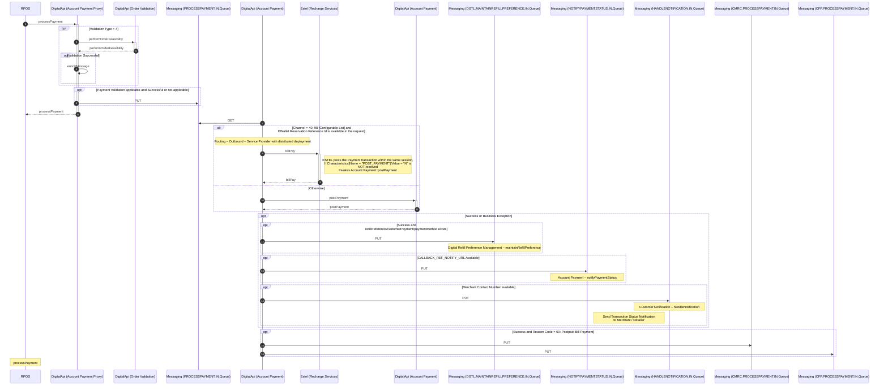
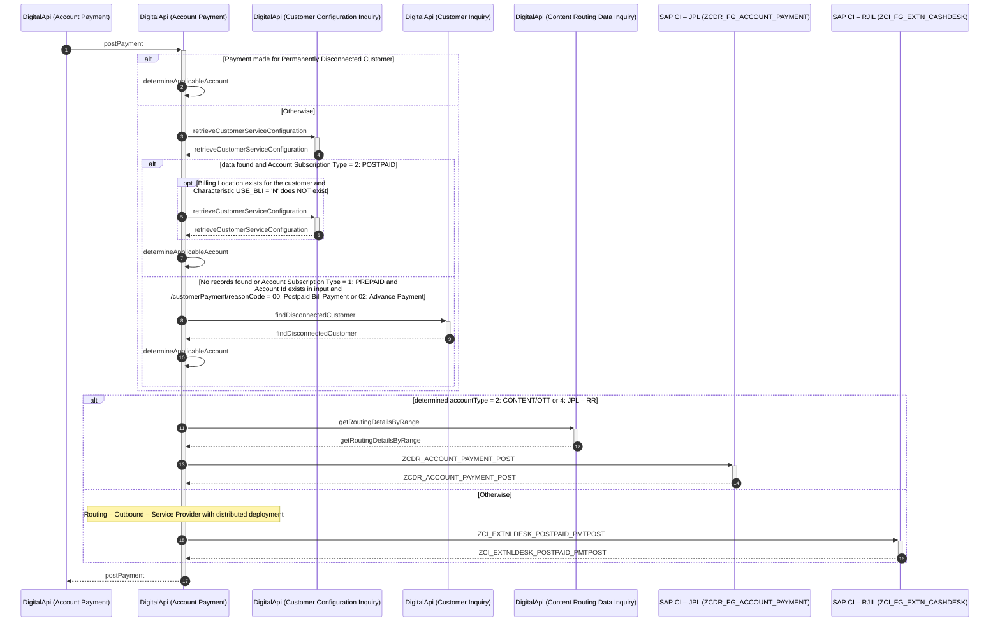
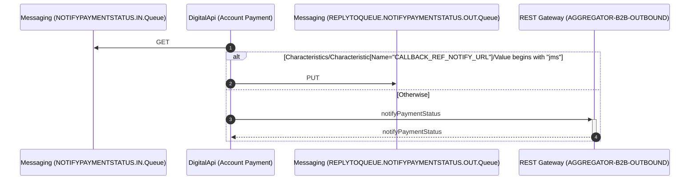

# Account Payment

## processPayment

| Service Characteristics | Values |
| --- | --- |
| **Service Name** | Account Payment |
| **Operation Name** | processPayment |
| **Provider** | <ul style="list-style-type: disc;"><li>Estel</li><li>Credit Management and Revenue Collection</li><li>Campaign Fulfillment Platform</li><li>SAP CI via. Account Payment::postPayment</li><li>SAP CRM – JPL, SAP CRM – JPL – RR via. Digital Refill Preference Management:maintainRefillPreference</li><li>SAP HANA (Routing DB) via. Routing Data Inquiry:getRoutingDetails</li></ul> |
| **Consumer** | <ul style="list-style-type: disc;"><li>Self Care</li><li>MyJio</li><li>RPOS</li><li>IVR</li><li>Credit Management and Revenue Collection</li><li>Third Party Aggregators</li><li>Jio Money</li><li>K2 BPM</li><ul style="list-style-type: circle;padding-left: 15px;"><li>Process Safe Custody Order</li></ul><li>DigitalApi Platform</li><ul style="list-style-type: circle;padding-left: 15px;"><li>Product Order Life Cycle Management:submitProductOrder</li><li>Digital Service Order Life Cycle Management:submitDigitalServiceOrder</li></ul><li>Orchestration Engine (OE)</li><ul style="list-style-type: circle;padding-left: 15px;"><li>Service Provisioning Activation</li><li>Process AutoRefill Payment</li><li>Process AutoRefill Payment – FTTx</li></ul></ul> |
| **Data Format** | Reliance SID |
| **Protocol / Transport** | <ul style="list-style-type: disc;"><li>SOAP/HTTP</li><ul style="list-style-type: circle;padding-left: 15px;"><li>IVR</li><li>Credit Management and Revenue Collection</li><li>Jio Money</li></ul><li>JSON/HTTP</li><ul style="list-style-type: circle;padding-left: 15px;"><li>Self Care</li><li>MyJio</li><li>RPOS</li><li>Third Party Aggregators</li></ul><li>XML/JMS</li><ul style="list-style-type: circle;padding-left: 15px;"><li>Orchestration Engine (OE)</li></ul><li>JSON/JMS</li><ul style="list-style-type: circle;padding-left: 15px;"><li>Orchestration Engine (OE)</li><li>DigitalApi Platform</li><ul style="list-style-type: square;padding-left: 15px;"><li>Digital Service Order Life Cycle Management:submitDigitalServiceOrder</li></ul><li>K2 BPM</li><ul style="list-style-type: square;padding-left: 15px;"><li>Process Safe Custody Order</li></ul></ul></ul> |
| **Mediation Pattern** | Service Translator |
| **Interaction Type** | Synchronous Update Request with Acknowledgment (overall Asynchronous) |

### Interaction Diagram

Following is a textual walk-through of the approach to implement Account Payment:processPayment operation.

1.  Upon receiving the request, the Account Payment Proxy component performs the basic semantic validations such as compliance of message with structure including the mandatory / optional elements. If the validations fail, an error message / fault is returned to the invoking component.

2.  If the Validation Type = 4: Bill Pay applicability, Account Payment Proxy component invokes [performOrderFeasibility](../../fulfillment/Common Fulfillment/Order Validation.md#performorderfeasibility) operation of [Order Validation](../../fulfillment/Common Fulfillment/Order Validation.md) service to validate if Bill Payment is applicable for Account or Product.

3.  In case of successful validation of Payment request, Order Validation component returns the response enriched with the retrieved information from [retrieveCustomerServiceConfiguration](../../inventory/Manage Customer Information/Customer Configuration Inquiry.md#retrievecustomerserviceconfiguration) operation of [Customer Configuration Inquiry](../../inventory/Manage Customer Information/Customer Configuration Inquiry.md) service. Account Payment Proxy component enriches the retrieved information in the request message; otherwise an error message / fault is returned to the invoking component.  
    **Note:** Enrichment is done to specify the JMS Message Property Routing Zone header – jioroute as a characteristic.

4.  If Payment Validation is applicable and successful or not applicable, Account Payment Proxy component persist the message into the messaging queue.

5.  The acknowledgement message including the Payment Reference Number (as received from Service Consumer) is then returned to the invoking component.

6.  Account Payment component consumes the message from the messaging queue.

7.  If Channel = 40: Dealer, 98: LCO [Configurable List] and EWallet Reservation Reference Id is available in the request

    1.  Account Payment component retrieves the transaction routing details (Endpoint URL) for the destination instance of Estel. Refer [Routing – Outbound – Service Component to route](../../appendices/Appendix G.md#routing-outbound-service-component-to-route) for details.

    2.  Account Payment component translates the message from Reliance SID to the proprietary format of Estel and invokes billPay operation of the Estel interface.  
        **Note:** If "EWallet Reservation Reference Id" is received, Estel commits the blocked wallet. If "EWallet Reservation Reference Id" is not received, the existing behavior to deduct the wallet continues.  
        **Note:** Estel does NOT invoke postPayment operation of Account Payment service to post the transaction in SAP CI when Characterisitics [Name = "POST_PAYMENT"]/Value = "N" is received; otherwise continues to post the transaction in SAP CI.  
        **Note:** List of channels is configurable.

8.  Otherwise

    1.  Account Payment component invokes the [postPayment](#postpayment) operation of [Account Payment](#account-payment) service to post the transaction in SAP CI.  
        **Note:** SAP CI submits Customer Notification (template id = 60600) upon posting of payment

9.  If (Success or Business Exception is received)

    1.  If Success and AutoRefill Preference exists (identified by /refillReference/customerPayment/paymentMethod exists)

        1.  Account Payment component invokes maintainRefillPreference operation of Digital Refill Preference Management service to submit request to register the AutoRefill Preference by persisting a message into the messaging queue.

    2.  If the Characteristic CALLBACK_REF_NOTIFY_URL is available in the request message

        1.  Account Payment component invokes [notifyPaymentStatus](#notifypaymentstatus) operation of [Account Payment](#account-payment) service to submit a request for sending notification to the third party aggregators by persisting a message into the messaging queue.

    3.  If Merchant Contact Number is available in response from Estel,

        1.  Account Payment component invokes handleNotification operation of Customer Notification service to submit a request for sending notification to the retailer / merchant by persisting a message into the messaging queue.

10.  If the Success response is received and Reason Code = "00": Postpaid Bill Payment,

    1.  Account Payment component persists the message to the messaging queue to be consumed by Credit Management and Revenue Collection System.

    2.  Account Payment component persists the message to the messaging queue to be consumed by Campaign Fulfillment Platform.  
        **Note:** Campaign Fulfillment Platforms uses the event to submit the request for feedback survey; refer to section Feedback Survey for Jio Stores for details  
        **Note:** Campaign Fulfillment Platforms uses the event to determine the eligibility and provide predefined rental discount vouchers for multi-month payment

## postPayment

| Service Characteristics | Values |
| --- | --- |
| **Service Name** | Account Payment |
| **Operation Name** | postPayment |
| **Provider** | <ul style="list-style-type: disc;"><li>SAP CI – RJIL</li><li>SAP CI – JPL</li><li>SAP CI – JPL – RR</li><li>SAP CI – RJIL, SAP CI – JPL, SAP CI – JPL – RR via. Customer Inquiry:findDisconnectedCustomer</li><li>EDIF, SAP CRM via. Customer Configuration Inquiry:retrieveCustomerServiceConfiguration</li><li>DigitalApi Platform Database via. Content Routing Data Inquiry:getRoutingDetailsByRange</li></ul> |
| **Consumer** | <ul style="list-style-type: disc;"><li>Estel</li><li>Account Payment::processPayment</li></ul> |
| **Data Format** | Reliance SID |
| **Protocol / Transport** | SOAP/HTTP |
| **Mediation Pattern** | Service Translator |
| **Interaction Type** | Synchronous request response |

### Interaction Diagram

Following is a textual walk-through of the approach to implement Account Payment:postPayment operation.

1.  Upon receiving the request, the Account Payment component performs the basic semantic validations such as compliance of message with structure including the mandatory / optional elements. If the validations fail, an error message / fault is returned to the invoking component.

2.  If Payment is made for Permanently Disconnected Customer (identified by /characteristics[attributeName = 'PMT_SCENARIO' and attributeValue = 'OS_PMT_DISC_CUST'] exists),

    1.  "Applicable" Account Id and Account Type is received in the request  
        accountId = /individual/customerAccount/accountID  
        accountType = /characteristics[attributeName='ACCOUNT_TYPE']/attributeValue

3.  Otherwise

    1.  Account Payment component invokes [retrieveCustomerServiceConfiguration](../../inventory/Manage Customer Information/Customer Configuration Inquiry.md#retrievecustomerserviceconfiguration) operation of [Customer Configuration Inquiry](../../inventory/Manage Customer Information/Customer Configuration Inquiry.md) service to retrieve Account ID(s) and Collection Agency, if available.  
        **Note:** If Account ID (identified by /customerPayment/CustomerAccount/accountID) is received in input,  
		specify /customer/CustomerAccount/accountID = </customer/customerAccount/accountID\>, filterKey = <ACCOUNT\>  
        **Note:** If Service Id (identified by /product/Identifier/value) is received in input,  
		specify /identifier/value = </product/Identifier/value\>, /identifier/subcategory = <2: CustomerServiceID\>, filterKey = <ACCOUNT\>  
        **Note:** Collection Agency is identified based on /customer/characteristics[name = 'Z00100']/value  
        **Note:** rjilAccountId is identified by /customer/customerAccount[accountType = '1']/accountId

    2.  If data found (identified by /resultStatus/status = 'SUCCESS') and Account Subscription Type = 2: POSTPAID (identified by /customer/customerAccount[1]/subscriptionType = '2'), Account Payment component identifies the "applicable" Account Id – RJIL or JPL or JPL – RR for the received request:

        1.  If Billing Location exists for the customer and Characteristic USE_BLI = 'N' does NOT exist (identified from response of retrieveCustomerServiceConfiguration; /customer/characteristics[name = 'CRMH04']/value exists and /characteristics[name = 'USE_BLI']/value = 'N' does NOT exist)  
            **Note:** Characteristic USE_BLI = 'N' is specified to NOT use the Billing Location, if exists
            -   Account Payment component invokes [retrieveCustomerServiceConfiguration](../../inventory/Manage Customer Information/Customer Configuration Inquiry.md#retrievecustomerserviceconfiguration) operation of [Customer Configuration Inquiry](../../inventory/Manage Customer Information/Customer Configuration Inquiry.md) service to retrieve Account ID(s) and Collection Agency for the Billing Location.  
                **Note:** specify /customerID = <from response of retrieveCustomerServiceConfiguration; /customer/characteristics[name = 'CRMH04']/value\>, filterKey = <ACCOUNT\>  
                **Note:** Collection Agency is identified based on /customer/characteristics[name = 'Z00100']/value  
                **Note:** Account details of Billing Location are used for further processing  
                **Note:** set useBiilingLocation = true

        2.  If /customerPayment/reasonCode = 00: Postpaid Bill Payment or 02: Advance Payment  
            **Note:** request is routed based on the collection agency
            -   if Collection Agency = JPL – RR (identified by /customer/characteristics[name = 'Z00100']/value = 'Z00095')
                -   accountType = 4: JPL – RR
                -   accountId = as retrieved from retrieveCustomerServiceConfiguration /customer/customerAccount[accountType = '4']/accountId
            -   else if Collection Agency = JPL or (Collection Agency doesn't exists and Account ID – JPL is retrieved and Customer is NOT a Billing Location) (identified by /customer/characteristics[name = 'Z00100']/value = 'Z00094' or (/customer/characteristics[name = 'Z00100'] does NOT exists and /customer/customerAccount[accountType = '2']/accountId exists and /customer/segment[name = 'CUSTOMER_CATEGORY']/value != '0007'))  
                **Note:** Caters to scenario of Payment made for Enterprise Customers through Third Party Aggregator; condition for existence check of Account Id – JPL is applicable only for retail Customers.
                -   accountType = 2: CONTENT/OTT
                -   accountId = as retrieved from retrieveCustomerServiceConfiguration /customer/customerAccount[accountType = '2']/accountId
            -   Otherwise
                -   accountType = 1: CONNECTIVITY
                -   accountId = as retrieved from retrieveCustomerServiceConfiguration /customer/customerAccount[accountType = '1']/accountId

        3.  Otherwise
            -   accountType = 1: CONNECTIVITY
            -   accountId = as retrieved from retrieveCustomerServiceConfiguration /customer/customerAccount[accountType = '1']/accountId

    3.  If (No data found (identified by error code = 7000: No records found) or Account Subscription Type = 1: PREPAID (identified by /customer/CustomerAccount/subscriptionType = 1: PREPAID)) and Account Id exists in input (identified by /customerPayment/CustomerAccount/accountID exists) and /customerPayment/reasonCode = 00: Postpaid Bill Payment or 02: Advance Payment,  
        **Note:** Caters to scenario of Payment made for Disconnected Customers through Third Party Aggregator or Auto-Payment.  
        **Note:** Caters to the scenario for reuse of JPL – RR Account Id also for the RJIL Prepaid Account ID. In an event of Disconnected Postpaid Customer making payment and same Account Id identifies the Pre-paid Customer resulting in incorrect routing; the Pre-paid Account Id is treated same as no record found.  
        **Note:** Applicable only for reasonCode = 00: Postpaid Bill Payment or 02: Advance Payment

        1.  Account Payment component invokes [findDisconnectedCustomer](../../inventory/Manage Customer Information/Customer Inquiry.md#finddisconnectedcustomer) operation of [Customer Inquiry](../../inventory/Manage Customer Information/Customer Inquiry.md) service to retrieve the details of the permanently disconnected customer.  
            **Note:** specify /customer/CustomerAccount/id = </customerPayment/CustomerAccount/accountID\>

        2.  "Applicable" Account Id and Account Type is returned in response
            -   accountType = as retrieved from findDisconnectedCustomer /customer/CustomerAccount/accountType
            -   accountId = as retrieved from findDisconnectedCustomer /customer/CustomerAccount/id

4.  If determined accountType = 2: CONTENT/OTT or 4: JPL – RR

    1.  Account Payment component invokes [getRoutingDetailsByRange](../../../digital/common/Manage Content Reference Data/Content Routing Data Inquiry.md#getroutingdetailsbyrange) operation of [Content Routing Data Inquiry](../../../digital/common/Manage Content Reference Data/Content Routing Data Inquiry.md) service to retrieve the transaction routing details (Endpoint URL) for the destination instance of SAP CI – JPL or SAP CI – JPL – RR.  
        **Note:** specify /routingData/serviceProvider = <if determined accountType = 4: JPL – RR, specify 09: SAP CI – JPL – RR; otherwise specify 02: SAP CI – JPL\>, /characteristics[name = 'ACCOUNT_ID']/value = <determined accountId\>.  
        **Note:** Routing Zone is identified by /routingData/characteristics[name = 'ROUTING_ZONE']/value

    2.  Account Payment component replaces the Account Id in the request message with the determined accountId (Account ID – JPL or Account Id – JPL – RR).

    3.  Account Payment component translates the request from CMM (Reliance SID) message to the proprietary message model of SAP and invoke the RFC ZCDR_ACCOUNT_PAYMENT_POST of SAP CI – JPL.  
        **Note:** Transaction routing details (Endpoint URL) for the destination instance of SAP CI – JPL is already identified in the steps above.

    4.  On receiving response from SAP CI, Account Payment component translates the message from the proprietary message model of SAP to the CMM (Reliance SID).

5.  Otherwise

    1.  Account Payment component retrieves the transaction routing details (Endpoint URL) for the destination instance of SAP CI – RJIL. Refer [Routing – Outbound – Service Component to route](../../appendices/Appendix G.md#routing-outbound-service-component-to-route) to route for details.  
        **Note:** specify determined accountId, if exists

    2.  Account Payment component translates the message from CMM (Reliance SID) to the proprietary message model of SAP and invokes SAP RFC ZCI_EXTNLDESK_POSTPAID_PMTPOST to post the payment in SAP CI.  
        **Note:** specify determined accountId, if exists  
        **Note:** If useBiilingLocation = true and /reasonCode IN [01: Security Deposit – Credit Limit Enhancement, 05: Security Deposit – International Roaming] [configurableList]  
		specify CHILD_ACCOUNT_ID = rjilAccountId

    3.  On receiving response from SAP CI, Account Payment component translates the message from the proprietary message model of SAP to the CMM (Reliance SID)

6.  Account Payment component returns the response to the invoking component.

## notifyPaymentStatus

| Service Characteristics | Values |
| --- | --- |
| **Service Name** | Account Payment |
| **Operation Name** | notifyPaymentStatus |
| **Message Provider** | DigitalApi Platform via. Account Payment:processPayment |
| **Message Consumer** | <ul style="list-style-type: disc;"><li>Third Party Aggregators</li><li>K2 BPM</li><ul style="list-style-type: circle;padding-left: 15px;"><li>Process Safe Custody Order</li></ul></ul> |
| **Data Format** | Reliance SID |
| **Protocol / Transport** | <ul style="list-style-type: disc;"><li>XML/JMS</li><li>JSON/JMS</li></ul> |
| **Mediation Pattern** | Message Translator |
| **Interaction Type** | One-way assured delivery |

### Interaction Diagram

Following is a textual walk-through of the approach to implement Account Payment: notifyPaymentStatus operation.

1.  Account Payment component consumes the message from the messaging queue.

2.  If Characteristics/Characteristic[Name="CALLBACK_REF_NOTIFY_URL"]/Value begins with "jms"

    1.  Account Payment component persists the message to the ReplyToQueue identified from the Value.  
        **Note:** Messaging Queue name is identified from the value of characteristic specified in following format jms/<ReplyToQueueName\>

3.  Otherwise

    1.  Account Payment component translates the request message from CMM (Reliance SID) and invokes (/accountpayment/notifyPaymentStatus) API (HTTP POST) exposed by REST Gateway (SECO) to update the status of account payment transaction to the third party aggregator.  

**Note:** For any System Exceptions, DigitalApi Platform retries the request.  
**Note:** REST Gateway (SECO) invokes the API exposed by the third party aggregator based on the callbackReference/notifyURL specified in the request.

## **Additional details**
[Refer to mapping sheet for list of data elements](https://jio.ril.com/sites/systems/design/Shared%20Documents/04.%20E2E%20Architecture%20and%20Solutions/02.%20Macro%20Design%20Documents/Functional%20Mappings/Account%20Payment.xls?Web=1)  
[Refer to Developer Portal for specifications](https://digitalapi.developers.jio.com/api/94)

### Change log
