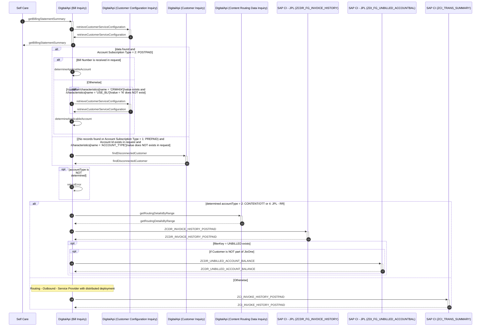
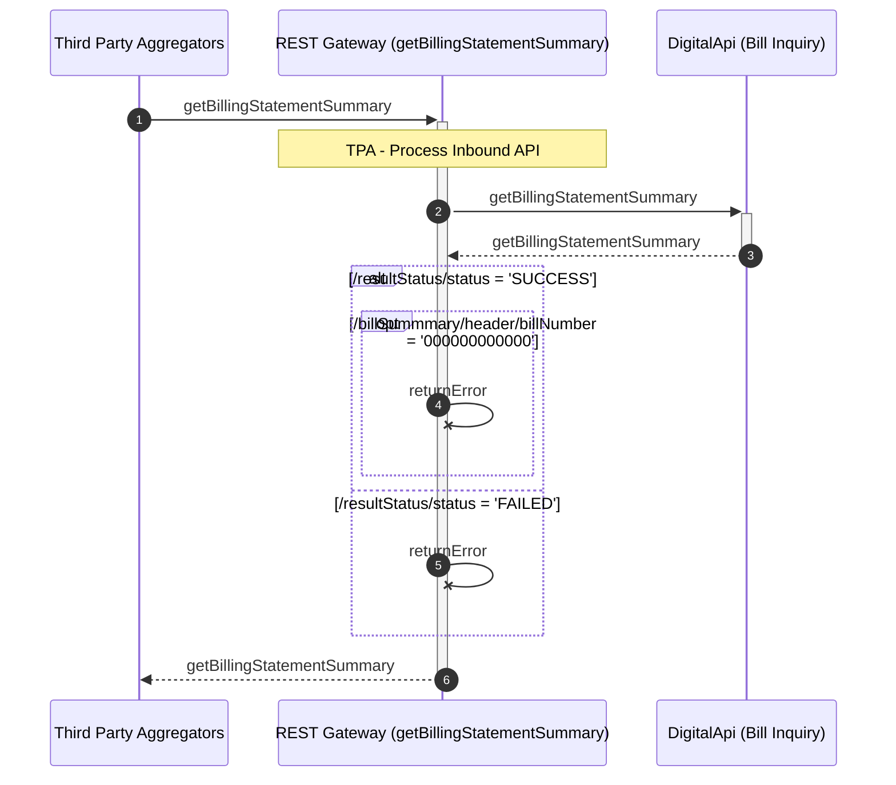
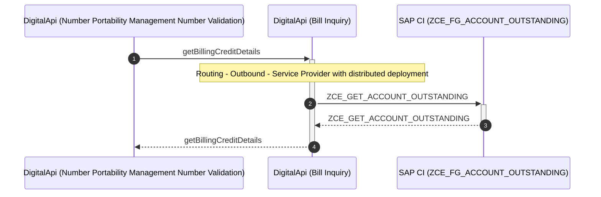
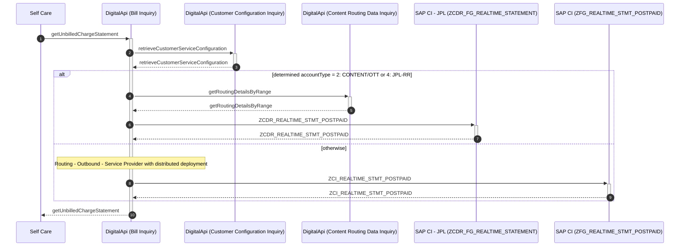
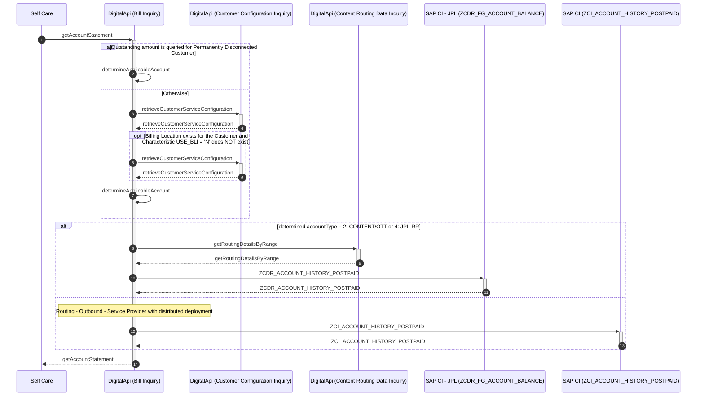
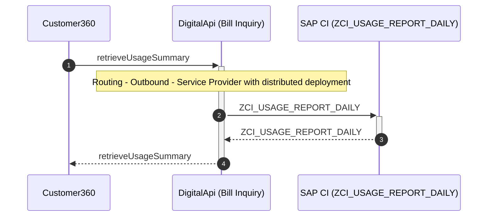
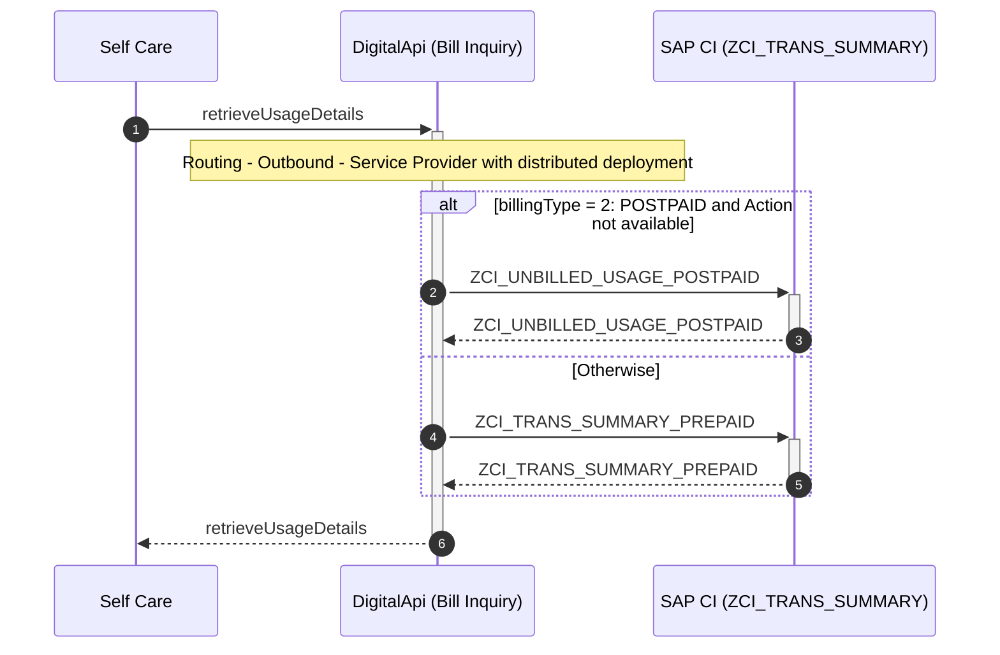
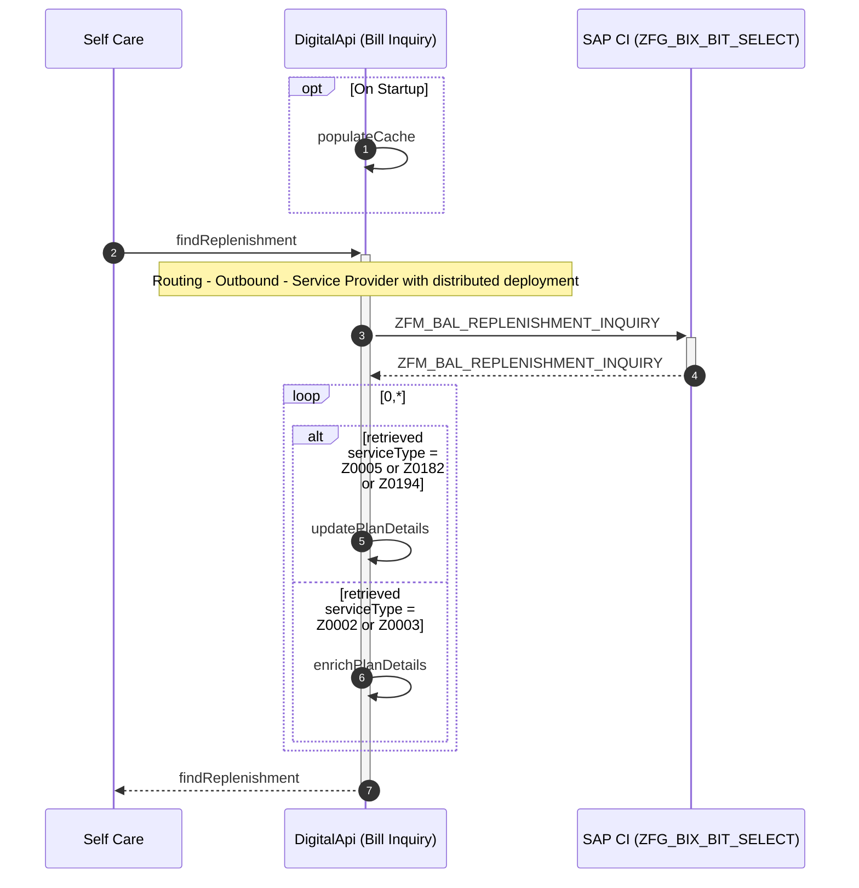
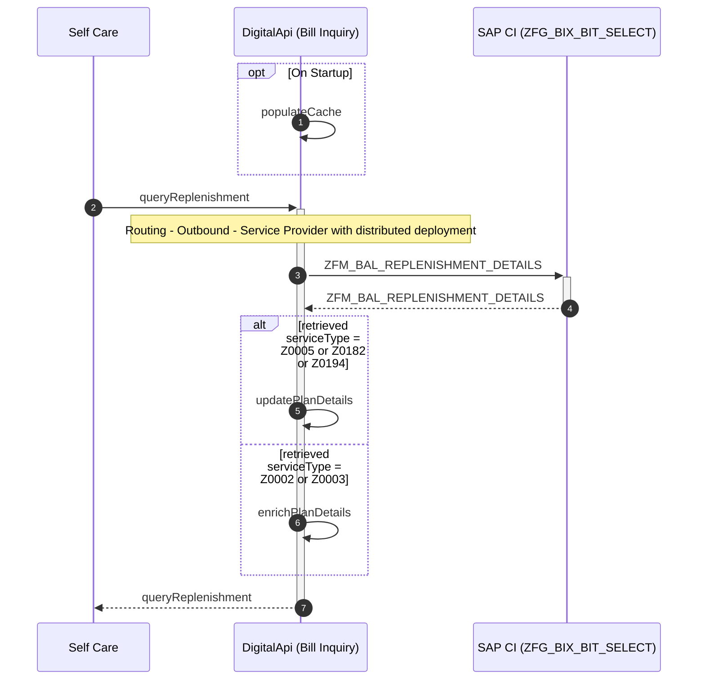

# Bill Inquiry

## getBillingStatementSummary

| **Service Characteristics** | **Values** |
| ---------------------------- | ---------- |
| **Service Name** | Bill Inquiry |
| **Operation Name** | getBillingStatementSummary |
| **Provider** | <ul style="list-style-type: disc;"><li>SAP CI – RJIL</li><li>SAP HANA (Routing DB) via. Routing Data Inquiry:getRoutingDetails</li><li>SAP CI – JPL</li><li>SAP CI – JPL – RR</li><li>DigitalApi Platform Database via. Content Routing Data Inquiry:getRoutingDetailsByRange</li><li>EDIF, SAP CRM via. Customer Configuration Inquiry:retrieveCustomerServiceConfiguration</li><li>SAP CI – RJIL, SAP CI – JPL, SAP CI – JPL – RR via. Customer Inquiry:findDisconnectedCustomer</li></ul> |
| **Consumer** | <ul style="list-style-type: disc;"><li>Self Care</li><li>MyJio</li><li>IVR</li><li>RPOS</li><li>JioAssist</li><li>Jio Money</li><li>Jio Subscription Management System (JSMS)</li><li>Third Party Aggregators</li></ul> |
| **Data Format** | Reliance SID |
| **Protocol / Transport** | <ul style="list-style-type: disc;"><li>SOAP/HTTP</li><ul style="list-style-type: circle;padding-left: 15px;"><li>Self Care</li><li>MyJio</li><li>IVR</li><li>Jio Money</li></ul><li>JSON/HTTP</li><ul style="list-style-type: circle;padding-left: 15px;"><li>RPOS</li><li>JioAssist</li><li>Jio Subscription Management System (JSMS)</li><li>Third Party Aggregators</li></ul></ul> |
| **Mediation Pattern** | Service Translator |
| **Interaction Type** | Synchronous read request |

### Interaction Diagram




Following is a textual walk-through of the Bill Inquiry – getBillingStatementSummary operation.

1.  Service Consumer (e.g. Self Care) invokes getBillingStatementSummary operation of Bill Inquiry service to get the summary of bill statement.

2.  Bill Inquiry component invokes [retrieveCustomerServiceConfiguration](../../../retail/inventory/Manage Customer Information/Customer Configuration Inquiry.md#retrievecustomerserviceconfiguration) operation of [Customer Configuration Inquiry](../../../retail/inventory/Manage Customer Information/Customer Configuration Inquiry.md) service to retrieve Account ID(s) and Collection Agency, if available.

    ``` title="Note:"
    If Account ID is received in request, 
	    specify /customer/CustomerAccount/accountID = </customerBill/customerAccount/accountID>, 
		/filterKey = <ACCOUNT>
    ```

    ``` title="Note:"
    If Service ID is received in request, 
	    specify /identifier/value = </customerBill/Product/identifier/value>, 
	    /identifier/subcategory = <2>, 
		/filterKey = ACCOUNT>
    ```

    ``` title="Note:"
    Collection Agency is identified based on /customer/characteristics[name = 'Z00100']/value
    ```

    ``` title="Note:"
    If Customer is part of JioOne (identified by /customer/segment[name = '46']/value = '120001' exist)
        set jioOneCustomer = true
    otherwise
        set jioOneCustomer = false
    ```

3.  If data found (identified by /resultStatus/status = 'SUCCESS') and Account Subscription Type = 2: POSTPAID (identified by /customer/customerAccount[1]/subscriptionType = '2'), Bill Inquiry component identifies the "applicable" Account Id – RJIL or JPL or JPL – RR for the received request:

    1.  If Bill Number is received in the request (identified by /customerBill/billNo exists)   
        **Note:** Request is routed based on the specified Account Id

        -  accountType = as retrieved from retrieveCustomerServiceConfiguration 
           /customer/CustomerAccount[accountID = '<accountId received in request\>']/accountType
        -  accountId = <accountId received in request /customerBill/customerAccount/accountID\>

    2.  If Bill Number is NOT received in the request (identified by /customerBill/billNo does NOT exists)

        1.  If Billing Location exist for the customer and Characteristic USE_BLI = 'N' does NOT exist (identified from response of retrieveCustomerServiceConfiguration; /customer/characteristics[name = 'CRMH04']/value exist and /characteristics[name = 'USE_BLI']/value = 'N' does NOT exist)

            **Note:** Characteristic USE_BLI = 'N' is specified to NOT use the Billing Location, if exists

            -  Bill Inquiry component invokes [retrieveCustomerServiceConfiguration](../../../retail/inventory/Manage Customer Information/Customer Configuration Inquiry.md#retrievecustomerserviceconfiguration) operation of [Customer Configuration Inquiry](../../../retail/inventory/Manage Customer Information/Customer Configuration Inquiry.md) service to retrieve Account ID(s) and Collection Agency for the Billing Location.
               ``` title="Note:"
               specify 
               /customerID = <from response of retrieveCustomerServiceConfiguration;
               /customer/characteristics[name = 'CRMH04']/value>,
               /filterKey = <ACCOUNT>
               ```
               ``` title="Note:"
               Collection Agency is identified based on /customer/characteristics[name = 'Z00100']/value
               ```
               ``` title="Note:"
               specify in response; /customerName/firstName = </customer/organization/organizationName>
               ```
               **Note:** Account details of Billing Location are used for further processing
			   
        2.  If statement is queried for specific account (from request message; /characteristics[name = 'ACCOUNT_TYPE']/value exists),

            -  accountType = <from request message; /characteristics[name = 'ACCOUNT_TYPE']/value\>
            -  accountId = <from response of retrieveCustomerServiceConfiguration; /customer/CustomerAccount[accountType = <accountType\>]/accountID\>

        3.  Otherwise  
            **Note:** request is routed based on the collection agency

            -  If Collection Agency = JPL – RR (identified by /customer/characteristics[attributeName = 'Z00100']/attributeValue = 'Z00095')
                *  accountType = 4: JPL – RR
                *  accountId = as retrieved from retrieveCustomerServiceConfiguration; /customer/CustomerAccount[accountType='4']/accountID

			- Else if Collection Agency = JPL or (Collection Agency doesn't exists and Account ID – JPL is retrieved) (identified by /customer/characteristics[attributeName = 'Z00100']/attributeValue = 'Z00094' or (/customer/characteristics[attributeName = 'Z00100'] does NOT exists and /customer/CustomerAccount[accountType='2']/accountID exists))
                * accountType = 2: CONTENT/OTT
                * accountId = as retrieved from retrieveCustomerServiceConfiguration; /customer/CustomerAccount[accountType='2']/accountID

            - Otherwise
                * accountType = 1: CONNECTIVITY
                * accountId = as retrieved from retrieveCustomerServiceConfiguration; /customer/CustomerAccount[accountType='1']/accountID

4.  If (No data found (identified by error code = 7000: No records found) or Account Subscription Type = 1: PREPAID (identified by /customer/CustomerAccount/subscriptionType = 1: PREPAID)) and Account Id exists in request (identified by customerBill/customerAccount/accountID exists) and /characteristics[name = 'ACCOUNT_TYPE']/value does NOT exist in request,  
    **Note:** Caters to scenario of Bill Statement Summary for Disconnected Customers.  
    **Note:** Caters to the scenario for reuse of JPL – RR Account Id also for the RJIL Prepaid Account ID. In an event of Disconnected Postpaid Customer and same Account Id identifies the Pre-paid Customer resulting in incorrect routing; the Pre-paid Account Id is treated same as no record found.

    1. Bill Inquiry component invokes invokes [findDisconnectedCustomer](../../../retail/inventory/Manage Customer Information/Customer Inquiry.md#finddisconnectedcustomer) operation of [Customer Inquiry](../../../retail/inventory/Manage Customer Information/Customer Inquiry.md) service to retrieve the details of the permanently disconnected customer.
        ``` title="Note:"
        specify /customer/CustomerAccount/id = </customerBill/customerAccount/accountID>
        ```
    2.  "Applicable" Account Id and Account Type is returned in response
        - accountType = as retrieved from findDisconnectedCustomer; /customer/CustomerAccount/accountType
        - accountId = as retrieved from findDisconnectedCustomer ; /customer/CustomerAccount/id

5.  If accountType is NOT determined
    1.  if Customer exists and Account Subscription Type = 1: PREPAID (identified from response of retrieveCustomerServiceConfiguration; /resultStatus/status = 'SUCCESS' and /customer/customerAccount[1]/subscriptionType = '1')
		1.  Bill Inquiry component returns /resultStatus/status = FAILED, /resultStatus/errorCode = 2612: Bill fetch is not supported for prepaid MSISDNs.
	2.  Otherwise
        1. Bill Inquiry component returns /resultStatus/status = FAILED, /resultStatus/errorCode = 7000: No records found

6.  If determined accountType = 2: CONTENT/OTT or 4: JPL – RR
    1. Bill Inquiry component invokes [getRoutingDetailsByRange](../../../digital/common/Manage Content Reference Data/Content Routing Data Inquiry.md#getroutingdetailsbyrange) operation of [Content Routing Data Inquiry](../../../digital/common/Manage Content Reference Data/Content Routing Data Inquiry.md) service to retrieve the transaction routing details (Endpoint URL) for the destination instance of SAP CI – JPL or SAP CI – JPL – RR.
      ``` title="Note:"
      specify /routingData/serviceProvider = 
          <if determined accountType = 4: JPL – RR, 
		      specify 09: SAP CI – JPL – RR; 
          otherwise 
		      specify 02: SAP CI – JPL>,
      /characteristics[name='ACCOUNT_ID']/value = <determined accountId>
      ```
    2.  Bill Inquiry component replaces the Account Id – RJIL in the request message with the determined accountId (Account ID – JPL or Account Id – JPL – RR).

    3. Bill Inquiry component translates the request from CMM (Reliance SID) message to the proprietary message model of SAP and invoke the RFC ZCDR_INVOICE_HISTORY_POSTPAID of SAP CI – JPL or SAP CI – JPL – RR.

    4.  On receiving response from SAP CI, Bill Inquiry component translates the message from the proprietary message model of SAP to the CMM (Reliance SID).

    5.  If /filterKey = 'UNBILLED' exists 
        1.  If Customer is NOT part of JioOne (jioOneCustomer = false)  
            **Note:** Unbilled Outstanding is NOT applicable for JioOne Customers

            -  Bill Inquiry component translates the request from CMM (Reliance SID) message to the proprietary message model of SAP and invoke the RFC ZCDR_UNBILLED_ACCOUNT_BALANCE of SAP CI – JPL or SAP CI – JPL – RR.
               ``` title="Note:"
               specify IV_ACCOUNT_ID = <determined accountId>, 
			   IV_PRIMARY_ACT_ID = <Do NOT specify any value>
               ```

        2.  On receiving response from SAP CI, Bill Inquiry component enriches the response message with calculated unbilled amount of remaining companies (JPL) except RJIL.

7.  Otherwise
    1.  Bill Inquiry component retrieves the transaction routing details (Endpoint URL) for the destination instance of SAP CI – RJIL. Refer [Routing – Outbound – Service Component to route](../../../retail/appendices/Appendix G.md#routing-outbound-service-component-to-route) for details.
        ``` title="Note:"
        specify determined accountId
        ```

    2.  Bill Inquiry component translates the request from CMM (Reliance SID) message to the proprietary message model of SAP and invoke the RFC ZCI_INVOKE_HISTORY_POSTPAID of SAP CI – RJIL.
        ``` title="Note:"
        specify determined accountId
        ```

    3.  On receiving response from SAP CI, Bill Inquiry component translates the message from the proprietary message model of SAP to the CMM (Reliance SID).

8.  Bill Inquiry component returns the response to the invoking component.


## Partner-v6-getBillingStatementSummary API



Following is a textual walk-through of Partner-v6-getBillingStatementSummary API.

1.  Upon receiving the request to retrieve billing statement summary for a customer having Mobile Postpaid product, REST Gateway determines the merchantCode and channelId. Refer [TPA – Process Inbound API](../../appendices/Appendix H.md#process-inbound-api) for details.

2.  REST Gateway invokes [getBillingStatementSummary](#getbillingstatementsummary) operation of [Bill Inquiry](#) service (Protocol / Transport = JSON/HTTP) to retrieve the bill summary of service.  

3.  If /resultStatus/status = 'SUCCESS'
    
	1.  if bill not found (identified by /billSummmary/header/billNumber = '000000000000')
        1.  return /success = false, /errors/code = 2611: Bill not found
    2.  else
        1.  return success response with Bill details

4.  Otherwise (/resultStatus/status = 'FAILED')
    1.  map the error codes and return error to the invoking component  
	    **Note:** Refer to the mapping sheet for the translation of error codes
	
5.  The response is then returned to invoking component.


## getBillingCreditDetails

| Service Characteristics | Values |
| :--- | :--- |
| **Service Name** | Bill Inquiry |
| **Operation Name** | getBillingCreditDetails |
| **Provider** | <ul style="list-style-type: disc;"><li>SAP CI</li><li>SAP HANA (Routing DB) via. Routing Data Inquiry:getRoutingDetails</li></ul> |
| **Consumer** | <ul style="list-style-type: disc;"><li>DigitalApi Platform<ul style="list-style-type: circle;padding-left: 15px;"><li>Number Portability Management Number Validation:receiveMessage</li><li>Number Portability Management Account Helper:sendMessage</li></ul></li></ul> |
| **Data Format** | Reliance SID |
| **Protocol / Transport** | <ul style="list-style-type: disc;"><li>JSON/HTTP</li></ul> |
| **Mediation Pattern** | Service Translator |
| **Interaction Type** | Synchronous read request |

### Interaction Diagram



Following is a textual walk-through of the Bill Inquiry – getBillingCreditDetails operation.

1.  Service Consumer (e.g. Self Care) invokes getBillingCreditDetails operation of Bill Inquiry service to get the billing credit details including the Outstanding balance.

2.  Bill Inquiry component retrieves the transaction routing details (Endpoint URL) for the destination instance of SAP CI. Refer [Routing – Outbound – Service Component to route](../../../retail/appendices/Appendix G.md#routing-outbound-service-component-to-route) for details.

3.  Bill Inquiry component translates the request from CMM(Reliance SID) message to the proprietary message model of SAP CI and invoke the RFC ZCE_GET_ACCOUNT_OUTSTANDING.

4.  On receiving response from SAP CI, Bill Inquiry component translates the message from the proprietary message model of SAP to the CMM (Reliance SID) and returns the response to the invoking component.


## getUnbilledChargeStatement

| Service Characteristics | Values |
| :--- | :--- |
| **Service Name** | Bill Inquiry |
| **Operation Name** | getUnbilledChargeStatement |
| **Provider** | <ul style="list-style-type: disc;"><li>SAP CI – RJIL</li><li>SAP HANA (Routing DB) via. Routing Data Inquiry:getRoutingDetails</li><li>SAP CI – JPL</li><li>SAP CI – JPL – RR</li><li>DigitalApi Platform Database via. Content Routing Data Inquiry:getRoutingDetailsByRange</li><li>EDIF, SAP CRM via. Customer Configuration Inquiry:retrieveCustomerServiceConfiguration</li></ul> |
| **Consumer** | <ul style="list-style-type: disc;"><li>Self Care</li><li>MyJio</li><li>JioAssist</li></ul> |
| **Data Format** | Reliance SID |
| **Protocol / Transport** | <ul style="list-style-type: disc;"><li>SOAP/HTTP<ul style="list-style-type: circle;padding-left: 15px;"><li>Self Care</li><li>MyJio</li></ul></li><li>JSON/HTTP<ul style="list-style-type: circle;padding-left: 15px;"><li>JioAssist</li></ul></li></ul> |
| **Mediation Pattern** | Service Translator |
| **Interaction Type** | Synchronous read request |

### Interaction Diagram



Following is a textual walk-through of the Bill Inquiry:getUnbilledChargeStatement operation.

1.  Service Consumer (e.g. Self Care) invokes getUnbilledChargeStatement operation of Bill Inquiry service to get the statement of unbilled charges.

2.  On receiving the request, Bill Inquiry component invokes [retrieveCustomerServiceConfiguration](../../inventory/Manage Customer Information/Customer Configuration Inquiry.md#retrievecustomerserviceconfiguration) operation of [Customer Configuration Inquiry](../../inventory/Manage Customer Information/Customer Configuration Inquiry.md) service to retrieve Account ID(s) and Collection Agency, if available.

    **Note:** specify /customerAccount/accountId = </customer/customerAccount/accountID\>, /filterKey = <ACCOUNT\>

    **Note:** Collection Agency is identified based on /customer/characteristics[name = 'Z00100']/value

3.  Bill Inquiry component identifies the "applicable" Account Id – RJIL or JPL or JPL – RR for the received request:

    **Note:** request is routed based on the collection agency

    1.  if Collection Agency = JPL – RR (identified by /customer/characteristics[name = 'Z00100']/value = 'Z00095')
        -  accountType = 4: JPL – RR
        -  accountId = as retrieved from retrieveCustomerServiceConfiguration /customer/customerAccount[accountType='4']/accountId

    2.  else if Collection Agency = JPL or (Collection Agency doesn't exists and Account ID – JPL is retrieved) (identified by /customer/characteristics[name = 'Z00100']/value = 'Z00094' or (/customer/characteristics[name = 'Z00100'] does NOT exists and /customer/customerAccount[accountType='2']/accountId exists))
        -  accountType = 2: CONTENT/OTT
        -  accountId = as retrieved from retrieveCustomerServiceConfiguration /customer/customerAccount[accountType='2']/accountId

    3.  Otherwise
        -  accountType = 1: CONNECTIVITY
        -  accountId = as retrieved from retrieveCustomerServiceConfiguration /customer/customerAccount[accountType='1']/accountId

4.  If determined accountType = 2: CONTENT/OTT or 4: JPL – RR
    1.  Bill Inquiry component invokes [getRoutingDetailsByRange](../../../digital/common/Manage Content Reference Data/Content Routing Data Inquiry.md#getroutingdetailsbyrange) operation of [Content Routing Data Inquiry](../../../digital/common/Manage Content Reference Data/Content Routing Data Inquiry.md) service to retrieve the transaction routing details (Endpoint URL) for the destination instance of SAP CI – JPL or SAP CI – JPL – RR.

        **Note:** specify /routingData/serviceProvider = <if determined accountType = 4: JPL – RR, specify 09: SAP CI – JPL – RR; otherwise specify 02: SAP CI – JPL\>, /characteristics[name='ACCOUNT_ID']/value = <determined accountId\>.

    2.  Bill Inquiry component replaces the Account Id – RJIL in the request message with the determined accountId (Account ID – JPL or Account Id – JPL – RR).

    3.  Bill Inquiry component translates the request from CMM (Reliance SID) message to the proprietary message model of SAP and invoke the RFC ZCDR_REALTIME_STMT_POSTPAID of SAP CI – JPL or SAP CI – JPL – RR.

    4.  On receiving response from SAP CI, Bill Inquiry component translates the message from the proprietary message model of SAP to the CMM (Reliance SID).

5.  Otherwise
    1.  Bill Inquiry component retrieves the transaction routing details (Endpoint URL) for the destination instance of SAP CI – RJIL. Refer [Routing – Outbound – Service Component to route](../../../retail/appendices/Appendix G.md#routing-outbound-service-component-to-route) for details.

        **Note:** specify determined accountId

    2.  Bill Inquiry component translates the request from CMM (Reliance SID) message to the proprietary message model of SAP and invoke the RFC ZCI_REALTIME_STMT_POSTPAID of SAP CI – RJIL.

        **Note:** specify determined accountId

    3.  On receiving response from SAP CI, Bill Inquiry component translates the message from the proprietary message model of SAP to the CMM (Reliance SID).

6.  Bill Inquiry component returns the response to the invoking component.


## getAccountStatement

| Service Characteristics | Values |
| :--- | :--- |
| **Service Name** | Bill Inquiry |
| **Operation Name** | getAccountStatement |
| **Provider** | <ul style="list-style-type: disc;"><li>SAP CI – RJIL</li><li>SAP HANA (Routing DB) via. Routing Data Inquiry:getRoutingDetails</li><li>SAP CI – JPL</li><li>SAP CI – JPL – RR</li><li>DigitalApi Platform Database via. Content Routing Data Inquiry:getRoutingDetailsByRange</li><li>EDIF, SAP CRM via. Customer Configuration Inquiry:retrieveCustomerServiceConfiguration</li></ul> |
| **Consumer** | <ul style="list-style-type: disc;"><li>Self Care</li><li>MyJio</li><li>RPOS</li><li>JioAssist</li><li>Jio Subscription Management System (JSMS)</li></ul> |
| **Data Format** | Reliance SID |
| **Protocol / Transport** | <ul style="list-style-type: disc;"><li>SOAP/HTTP<ul style="list-style-type: circle;padding-left: 15px;"><li>Self Care</li><li>MyJio</li><li>RPOS</li></ul></li><li>JSON/HTTP<ul style="list-style-type: circle;padding-left: 15px;"><li>JioAssist</li><li>Jio Subscription Management System (JSMS)</li></ul></li></ul> |
| **Mediation Pattern** | Service Translator |
| **Interaction Type** | Synchronous read request |

### Interaction Diagram



Following is a textual walk-through of the Bill Inquiry – getAccountStatement operation.

1.  Service Consumer (e.g. Self Care) invokes getAccountStatement operation of Bill Inquiry service to get the account statement which includes bill, payment history, security deposit and payment reversals.

2.  If Outstanding Amount is queried for Permanently Disconnected Customer (identified by /characteristics[name = 'PMT_SCENARIO' and value = 'OS_PMT_DISC_CUST'] exists),
    1.  "Applicable" Account Id and Account Type is received in the request
        -  accountId = /accountId
        -  accountType = /characteristics[name='ACCOUNT_TYPE']/value

3.  Otherwise
    1.  Bill Inquiry component invokes [retrieveCustomerServiceConfiguration](../../inventory/Manage Customer Information/Customer Configuration Inquiry.md#retrievecustomerserviceconfiguration) operation of [Customer Configuration Inquiry](../../inventory/Manage Customer Information/Customer Configuration Inquiry.md) service to retrieve Account ID(s) and Collection Agency, if available.

        **Note:** specify /customerAccount/accountId = </accountId\>, filterKey = <ACCOUNT\>

        **Note:** Collection Agency is identified based on /customer/characteristics[name = 'Z00100']/value

    2.  If Billing Location exists for the customer and Characteristic USE_BLI = 'N' does NOT exist (identified from response of retrieveCustomerServiceConfiguration; /customer/characteristics[name = 'CRMH04']/value exists and /characteristics[name = 'USE_BLI']/value = 'N' does NOT exist)

        **Note:** Characteristic USE_BLI = 'N' is specified to NOT use the Billing Location, if exists

        1.  Bill Inquiry component invokes [retrieveCustomerServiceConfiguration](../../inventory/Manage Customer Information/Customer Configuration Inquiry.md#retrievecustomerserviceconfiguration) operation of [Customer Configuration Inquiry](../../inventory/Manage Customer Information/Customer Configuration Inquiry.md) service to retrieve Account ID(s) and Collection Agency for the Billing Location.

            **Note:** specify /customerID = <from response of retrieveCustomerServiceConfiguration; /customer/characteristics[name = 'CRMH04']/value\>, filterKey = <ACCOUNT\>

            **Note:** Collection Agency is identified based on /customer/characteristics[name = 'Z00100']/value

            **Note:** Account details of Billing Location are used for further processing

    3.  Bill Inquiry component identifies the "applicable" Account Id – RJIL or JPL or JPL – RR for the received request:

        **Note:** request is routed based on the collection agency

        1.  if Collection Agency = JPL – RR (identified by /customer/characteristics[name = 'Z00100']/value = 'Z00095')
            -  accountType = 4: JPL – RR
            -  accountId = as retrieved from retrieveCustomerServiceConfiguration /customer/customerAccount[accountType = '4']/accountId

        2.  else if Collection Agency = JPL or (Collection Agency doesn't exists and Account ID – JPL is retrieved) (identified by /customer/characteristics[name = 'Z00100']/value = 'Z00094' or (/customer/characteristics[name = 'Z00100'] does NOT exists and /customer/customerAccount[accountType = '2']/accountId exists))
            -  accountType = 2: CONTENT/OTT
            -  accountId = as retrieved from retrieveCustomerServiceConfiguration /customer/customerAccount[accountType = '2']/accountId

        3.  Otherwise
            -  accountType = 1: CONNECTIVITY
            -  accountId = as retrieved from retrieveCustomerServiceConfiguration /customer/customerAccount[accountType = '1']/accountId

4.  If determined accountType = 2: CONTENT/OTT or 4: JPL – RR
    1.  Bill Inquiry component invokes [getRoutingDetailsByRange](../../../digital/common/Manage Content Reference Data/Content Routing Data Inquiry.md#getroutingdetailsbyrange) operation of [Content Routing Data Inquiry](../../../digital/common/Manage Content Reference Data/Content Routing Data Inquiry.md) service to retrieve the transaction routing details (Endpoint URL) for the destination instance of SAP CI – JPL or SAP CI – JPL – RR.

        **Note:** specify /routingData/serviceProvider = <if determined accountType = 4: JPL – RR, specify 09: SAP CI – JPL – RR; otherwise specify 02: SAP CI – JPL\>, /characteristics[name='ACCOUNT_ID']/value = <determined accountId\>.

    2.  Bill Inquiry component replaces the Account Id in the request message with the determined accountId (Account ID – JPL or Account Id – JPL – RR).

    3.  Bill Inquiry component translates the request from CMM (Reliance SID) message to the proprietary message model of SAP and invoke the RFC ZCDR_ACCOUNT_HISTORY_POSTPAID of SAP CI – JPL or SAP CI – JPL – RR.

        **Note:** Transaction routing details (Endpoint URL) for the destination instance of SAP CI – JPL or SAP CI – JPL – RR is already identified in the steps above.

    4.  On receiving response from SAP CI, Bill Inquiry component translates the message from the proprietary message model of SAP to the CMM (Reliance SID).

5.  Otherwise
    1.  Bill Inquiry component retrieves the transaction routing details (Endpoint URL) for the destination instance of SAP CI – RJIL. Refer [Routing – Outbound – Service Component to route](../../../retail/appendices/Appendix G.md#routing-outbound-service-component-to-route) for details.

        **Note:** specify determined accountId

    2.  Bill Inquiry component translates the request from CMM (Reliance SID) message to the proprietary message model of SAP and invoke the RFC ZCI_ACCOUNT_HISTORY_POSTPAID of SAP CI – RJIL.

        **Note:** specify determined accountId

    3.  On receiving response from SAP CI, Bill Inquiry component translates the message from the proprietary message model of SAP to the CMM (Reliance SID).

6.  Bill Inquiry component returns the response to the invoking component.


## retrieveUsageSummary

| Service Characteristics | Values |
| :--- | :--- |
| **Service Name** | Bill Inquiry |
| **Operation Name** | retrieveUsageSummary |
| **Provider** | <ul style="list-style-type: disc;"><li>SAP CI</li><li>SAP HANA (Routing DB) via. Routing Data Inquiry:getRoutingDetails</li></ul> |
| **Consumer** | <ul style="list-style-type: disc;"><li>Customer360</li></ul> |
| **Data Format** | Reliance SID |
| **Protocol / Transport** | <ul style="list-style-type: disc;"><li>SOAP/HTTP<ul style="list-style-type: circle;padding-left: 15px;"><li>Customer360</li></ul></li></ul> |
| **Mediation Pattern** | Service Translator |
| **Interaction Type** | Synchronous read request |

### Interaction Diagram



Following is a textual walk-through of the Bill Inquiry – retrieveUsageSummary operation.

1.  Service Consumer (e.g. MyJio) invokes retrieveUsageSummary operation of Bill Inquiry service to get the usage summary (recent usage records for Prepaid or Postpaid) for a Product.

2.  On receiving the request, Bill Inquiry component retrieves the transaction routing details (Endpoint URL) for the destination instance of SAP CI – RJIL. Refer Routing – Outbound – Service Component to route for details.

3.  Bill Inquiry component translates the request Reliance SID message to the proprietary message model of SAP CI and invoke the RFC ZCI_USAGE_REPORT_DAILY.

4.  On receiving response from SAP CI, Bill Inquiry component translates the message from the proprietary message model of SAP to the CMM (Reliance SID) and returns the response to the invoking component.

## retrieveUsageDetails

| Service Characteristics | Values |
| :--- | :--- |
| **Service Name** | Bill Inquiry |
| **Operation Name** | retrieveUsageDetails |
| **Provider** | <ul style="list-style-type: disc;"><li>SAP CI</li><li>SAP HANA (Routing DB) via. Routing Data Inquiry:getRoutingDetails</li></ul> |
| **Consumer** | <ul style="list-style-type: disc;"><li>Self Care</li><li>MyJio</li><li>Novel Vox iAgent</li><li>Customer360</li><li>Haptik Chatbot</li><li>EPSP</li></ul> |
| **Data Format** | Reliance SID |
| **Protocol / Transport** | <ul style="list-style-type: disc;"><li>SOAP/HTTP<ul style="list-style-type: circle;padding-left: 15px;"><li>Novel Vox iAgent</li><li>Customer360</li><li>Haptik Chatbot</li></ul></li><li>JSON/HTTP<ul style="list-style-type: circle;padding-left: 15px;"><li>EPSP</li><li>Self Care</li><li>MyJio</li></ul></li></ul> |
| **Mediation Pattern** | Service Translator |
| **Interaction Type** | Synchronous read request |

### Interaction Diagram



Following is a textual walk-through of the Bill Inquiry – retrieveUsageDetails operation.

1.  Service Consumer (e.g. Self Care) invokes retrieveUsageDetails operation of Bill Inquiry service to get the usage details for a Product or Invoice.

2.  Bill Inquiry component retrieves the transaction routing details (Endpoint URL) for the destination instance of SAP CI. Refer [Routing – Outbound – Service Component to route](../../../retail/appendices/Appendix G.md#routing-outbound-service-component-to-route) for details.

3.  If billingType = 2: POSTPAID and Action not available:
    1.  Bill Inquiry component translates the request from Reliance SID message to the proprietary message model of SAP and invoke the SAP CI RFC ZCI_UNBILLED_USAGE_POSTPAID.

4.  Otherwise
    1.  Bill Inquiry component translates the request from Reliance SID message to the proprietary message model of SAP and invoke the SAP CI RFC ZCI_TRANS_SUMMARY_PREPAID.

5.  On receiving response from SAP CI, Bill Inquiry component translates the message from the proprietary message model of SAP to the CMM (Reliance SID) and returns the response to the invoking component.


## findReplenishment

| Service Characteristics | Values |
| :--- | :--- |
| **Service Name** | Bill Inquiry |
| **Operation Name** | findReplenishment |
| **Provider** | <ul style="list-style-type: disc;"><li>SAP CI</li><li>SAP HANA (Routing DB) via. Routing Data Inquiry:getRoutingDetails</li></ul> |
| **Consumer** | <ul style="list-style-type: disc;"><li>Novel Vox iAgent</li><li>mAssist</li><li>Self Care</li><li>MyJio</li><li>IVR</li><li>Haptik Chatbot</li></ul> |
| **Data Format** | Reliance SID |
| **Protocol / Transport** | <ul style="list-style-type: disc;"><li>SOAP/HTTP<ul style="list-style-type: circle;padding-left: 15px;"><li>Novel Vox iAgent</li><li>Self Care</li><li>MyJio</li><li>IVR</li><li>Haptik Chatbot</li></ul></li><li>JSON/HTTP<ul style="list-style-type: circle;padding-left: 15px;"><li>mAssist</li></ul></li></ul> |
| **Mediation Pattern** | Service Translator |
| **Interaction Type** | Synchronous read request |

### Interaction Diagram



Following is a textual walk-through of the Bill Inquiry:findReplenishment operation.

1.  On Startup, Bill Inquiry component creates a cache of following data elements:  

    **For ==JioHome== (JioFiber, ==JioAirFiberMU and JioAirFiberUBR==) Plan Offerings**  
	
    -  Plan Offering Id (for JioFiber, ==JioAirFiberMU, JioAirFiberUBR==)
    -  Parent Plan Offering (Optional)
        *  Id
        *  Name
        *  Price

    **For VoLTE Plan Offerings**  
	
    -  Plan Offering Id (for VoLTE)
    -  Any PlanSpecification.serviceSpecificationId (IR_EXISTS) = F30003: International Roaming (via. PlanOfferingToPlanSpecMapping) for the Plan Offering
    -  Any PlanSpecification.serviceSpecificationId (ISD_EXISTS) = F30002: ISD (via. PlanOfferingToPlanSpecMapping) for the Plan Offering  

    **Note:** Data elements are retrieved using native connection to EDIF

    -  Determine the Plan Offering Id(s) and Plan Offering Type applicable for ==JioHome== (JioFiber, ==JioAirFiberMU and JioAirFiberUBR==)
        *  identified by Plan Offering(s) for which any Plan Offering.category = 3: FTTx Retail OR 4: FTTx Enterprise OR 9: FTTx + OTT Retail OR 10: FTTx + OTT Enterprise OR 15: FTTx + OTT + Finance Retail OR 16: FTTx + OTT + Finance Enterprise ==OR 28: JioAirFiberUBR + OTT Retail OR 29: JioAirFiberUBR + OTT Enterprise OR 30: JioAirFiberUBR Retail OR 31: JioAirFiberUBR Enterprise OR 32: JioAirFiberMU + OTT Retail OR 33: JioAirFiberMU + OTT Enterprise OR 34: JioAirFiberMU Retail OR 35: JioAirFiberMU Enterprise==
    -  For the Plan Offering Id with type = 1: CONNECTIVITY RECHARGE OR 2: CONNECTIVITY STARTUP OR 26: NONMONETARY TOPUP INHERITING VALIDITY ONLY, identify the Parent Plan Offering with subType = 51: Wrapper for Sales Channel
        *  via. planOfferingDependency.parentPlanOfferingId specifying childPlanOfferingId = <PlanOfferingId\>
    -  If Parent Plan Offering is identified
        *  For the Parent Plan Offering, retrieve the Plan Offering Name
            -  via. PlanOffering.Name specifying PlanOffering.id = <Parent Plan Offering Id\>
        *  For the Parent Plan Offering, identify the Composite Price Id
            -  via. planOfferingToCompositePriceMap.compositePriceId specifying PlanOfferingId = <Parent Plan Offering Id\>
        *  For the Composite Price Id, identify the Composite Price
            -  via. CompositePrice.Price specifying Id IN <Composite Price Id(s)\>
            -  If 1 record is found, use as-is
            -  If more than one Composite Price Id is retrieved, use the Composite Price with priceType = 2: ONETIME and priceSubType = 10: PAYABLE

    UNION

    -  retrieve the list of DISTINCT PlanOffering applicable for VoLTE with applicable indicator for ISD, IR; PlanOffering.id, PlanSpecification.serviceSpecificationId

        **Note:** all VoLTE PlanOffering are maintained in cache with corresponding indicator of applicable ISD or IR; maintain the PlanSpecification.serviceSpecificationId in cache for values [F30002, F30003]

    -  based on PlanOffering, planOfferingToPlanSpecMapping, PlanSpecification
        *  where PlanOffering.category = 1: Retail OR 2: Enterprise OR value does NOT exists and
        *  PlanOffering.billingType = 1: PREPAID OR 3: HYBRID and
        *  PlanSpecification.serviceType IN [Z0002, Z0003]

2.  Service Consumer (e.g. Novel Vox) invokes findReplenishment operation of Bill Inquiry service to get a list of Balance Replenishment transactions.

3.  On receiving the request, Bill Inquiry component retrieves the transaction routing details (Endpoint URL) for the destination instance of SAP CI. Refer [Routing – Outbound – Service Component to route](../../../retail/appendices/Appendix G.md#routing-outbound-service-component-to-route) for details.

4.  Bill Inquiry component translates the request from CMM (Reliance SID) message to the proprietary message model of SAP and invoke the RFC ZFM_BAL_REPLENISHMENT_INQUIRY.

    **Note:** SAP CI retrieves the Replenishment Transactions from both SAP CI – RJIL and SAP CI – JPL; consolidates and sorts replenishment transactions based upon Transaction Timestamp and returns requested number of records in response.

    **Note:** Retrieves Digital Service – Standalone and Digital Service – Third Party App transactions from SAP CI – JPL.

    **Note:** Customer Id – JPL and Account Id – JPL is returned in the response for Digital Service – Standalone or Digital Service – Third Party App transactions retrieved from SAP CI – JPL.

5.  On receiving response from SAP CI, iterate though each retrieved Replenishment Order
    1.  if retrieved serviceType = Z0005: Fiber ==or Z0182: JioAirFiberUBR Data or Z0194: JioAirFiberMU Data==
        1.  Fetch the details of the Plan Offering in Cache based on the retrieved Plan Offering Id
        2.  If Plan Offering Id is NOT available in Cache
            -  Retrieve the details of Parent Plan Offering with subType = 51: Wrapper for Sales Channel for the Plan Offering Id with type = 1: CONNECTIVITY RECHARGE OR 2: CONNECTIVITY STARTUP OR 26: NONMONETARY TOPUP INHERITING VALIDITY ONLY
            -  Update the Cache with the Plan Offering Id and corresponding Parent Plan Offering details, if available
        3.  If Plan Offering Id exists in the Cache and details of Parent Plan Offering Id is available
            -  In the response following elements are provided from the details of Parent Plan Offering than the retrieved Plan Offering
                *  Plan Offering Id
                *  Plan Offering Name
                *  Gross Amount
        4.  Otherwise
            -  return the retrieved Plan Offering as-is

    2.  else if retrieved serviceType = Z0002: Mobile Data or Z0003: LTE-Voice
        1.  Fetch the details of the Plan Offering in Cache based on the retrieved Plan Offering Id
        2.  if Plan Offering Id is NOT available in Cache
            -  retrieve the details of Plan Offering with applicable indicator for ISD, IR; PlanOffering.id, PlanSpecification.serviceSpecificationId

                **Note:** Details of DISTINCT VoLTE PlanOffering are maintained in cache with corresponding indicator of applicable ISD or IR; maintain the PlanSpecification.serviceSpecificationId in cache for values [F30002, F30003]

            -  based on PlanOffering, planOfferingToPlanSpecMapping, PlanSpecification
                *  where PlanOffering.id = <retrieved Plan Offering Id\>
            -  Update the Cache with the Plan Offering Id and corresponding indicator of applicable ISD or IR, if available  
			
        3.  if Plan Offering Id exists in the Cache and value exist for IR_EXISTS or ISD_EXISTS
            -  augment the values in the response;  
			
                if value exists for IR_EXISTS  
                specify /replenishmentOrderLineItem/characteristics[name = 'IR_EXISTS']/value = <value of IR_EXISTS\>  
                if value exits for ISD_EXISTS  
                specify /replenishmentOrderLineItem/characteristics[name = 'ISD_EXISTS']/value = <value of ISD_EXISTS\>  
				
        4.  Otherwise
            -  return the retrieved Plan Offering as-is

    3.  Otherwise
        1.  return the retrieved Plan Offering as-is

6.  Bill Inquiry component translates the message from the proprietary message model of SAP to the CMM (Reliance SID) and returns the response to the invoking component.


## queryReplenishment

| Service Characteristics | Values |
| :--- | :--- |
| **Service Name** | Bill Inquiry |
| **Operation Name** | queryReplenishment |
| **Provider** | <ul style="list-style-type: disc;"><li>SAP CI</li><li>SAP HANA (Routing DB) via. Routing Data Inquiry:getRoutingDetails</li></ul> |
| **Consumer** | <ul style="list-style-type: disc;"><li>Novel Vox iAgent</li><li>MyJio</li><li>Self Care</li></ul> |
| **Data Format** | Reliance SID |
| **Protocol / Transport** | <ul style="list-style-type: disc;"><li>SOAP/HTTP<ul style="list-style-type: circle;padding-left: 15px;"><li>Novel Vox iAgent</li><li>MyJio</li><li>Self Care</li></ul></li></ul> |
| **Mediation Pattern** | Service Translator |
| **Interaction Type** | Synchronous read request |

### Interaction Diagram



Following is a textual walk-through of the Bill Inquiry:queryReplenishment operation.

1.  On Startup, Bill Inquiry component creates a cache of following data elements:  

    **For ==JioHome== (JioFiber, ==JioAirFiberMU and JioAirFiberUBR==) Plan Offerings**  
	
    -  Plan Offering Id (for JioFiber, ==JioAirFiberMU, JioAirFiberUBR==)
    -  Parent Plan Offering (Optional)
        *  Id
        *  Name
        *  Price

    **For VoLTE Plan Offerings**  
	
    -  Plan Offering Id (for VoLTE)
    -  Any PlanSpecification.serviceSpecificationId (IR_EXISTS) = F30003: International Roaming (via. PlanOfferingToPlanSpecMapping) for the Plan Offering
    -  Any PlanSpecification.serviceSpecificationId (ISD_EXISTS) = F30002: ISD (via. PlanOfferingToPlanSpecMapping) for the Plan Offering  

    **Note:** Data elements are retrieved using native connection to EDIF

    -  Determine the Plan Offering Id(s) and Plan Offering Type applicable for ==JioHome== (JioFiber, ==JioAirFiberMU and JioAirFiberUBR==
        *  identified by Plan Offering(s) for which any Plan Offering.category = 3: FTTx Retail OR 4: FTTx Enterprise OR 9: FTTx + OTT Retail OR 10: FTTx + OTT Enterprise OR 15: FTTx + OTT + Finance Retail OR 16: FTTx + OTT + Finance Enterprise ==OR 28: JioAirFiberUBR + OTT Retail OR 29: JioAirFiberUBR + OTT Enterprise OR 30: JioAirFiberUBR Retail OR 31: JioAirFiberUBR Enterprise OR 32: JioAirFiberMU + OTT Retail OR 33: JioAirFiberMU + OTT Enterprise OR 34: JioAirFiberMU Retail OR 35: JioAirFiberMU Enterprise==
    -  For the Plan Offering Id with type = 1: CONNECTIVITY RECHARGE OR 2: CONNECTIVITY STARTUP OR 26: NONMONETARY TOPUP INHERITING VALIDITY ONLY, identify the Parent Plan Offering with subType = 51: Wrapper for Sales Channel
        *  via. planOfferingDependency.parentPlanOfferingId specifying childPlanOfferingId = <PlanOfferingId\>
    -  If Parent Plan Offering is identified
        *  For the Parent Plan Offering, retrieve the Plan Offering Name
            -  via. PlanOffering.Name specifying PlanOffering.id = <Parent Plan Offering Id\>
        *  For the Parent Plan Offering, identify the Composite Price Id
            -  via. planOfferingToCompositePriceMap.compositePriceId specifying PlanOfferingId = <Parent Plan Offering Id\>
        *  For the Composite Price Id, identify the Composite Price
            -  via. CompositePrice.Price specifying Id IN <Composite Price Id(s)\>
            -  If 1 record is found, use as-is
            -  If more than one Composite Price Id is retrieved, use the Composite Price with priceType = 2: ONETIME and priceSubType = 10: PAYABLE

    UNION

    -  retrieve the list of DISTINCT PlanOffering applicable for VoLTE with applicable indicator for ISD, IR; PlanOffering.id, PlanSpecification.serviceSpecificationId

        **Note:** all VoLTE PlanOffering are maintained in cache with corresponding indicator of applicable ISD or IR; maintain the PlanSpecification.serviceSpecificationId in cache for values [F30002, F30003]

    -  based on PlanOffering, planOfferingToPlanSpecMapping, PlanSpecification
        *  where PlanOffering.category = 1: Retail OR 2: Enterprise OR value does NOT exists and
        *  PlanOffering.billingType = 1: PREPAID OR 3: HYBRID and
        *  PlanSpecification.serviceType IN [Z0002, Z0003]

2.  Service Consumer (e.g. Novel Vox) invokes queryReplenishment operation of Bill Inquiry service to get details of selected Balance Replenishment transaction.

3.  On receiving the request, Bill Inquiry component retrieves the transaction routing details (Endpoint URL) for the destination instance of SAP CI. Refer [Routing – Outbound – Service Component to route](../../../retail/appendices/Appendix G.md#routing-outbound-service-component-to-route) for details.

4.  Bill Inquiry component translates the request from CMM (Reliance SID) message to the proprietary message model of SAP and invoke the RFC ZFM_BAL_REPLENISHMENT_DETAILS.

    **Note:** SAP CI maintains the allowance BITS (Monetary and Non-Monetary Balance) of last 180 days to determine the Status and Validity Period

    The BITS for which Net Amount (i.e. BIT AMOUNT) \> 0 only those allowances are stored; resulting in any Plan Offering with net amount as zero, not returned in the response.

    Status and Validity Period is returned for Connectivity Balance Replenishment Transaction(s) only; Not returned for Digital Service(s)

    For Top-up transaction, "End Date" is not applicable, for those Plan Offering(s) SAP CI returns value as "NEVER EXPIRES"

    ```title="Note"
	SAP CI determines Plan Offering(s) based upon "Replenishment Order Reference Number" from SAP CI – RJIL
    
	If no data found,
        SAP CI determines Plan Offering(s) based on "Replenishment Order Reference Number" from SAP CI – JPL
        Returns the Digital Service – Standalone Plan Offering transactions
    Otherwise
        Returns the Connectivity Plan Offering transactions
    ```
	
    **Note:** Retrieves Digital Service – Standalone and Digital Service – Third Party App transactions from SAP CI – JPL.

    **Note:** Customer Id – JPL and Account Id – JPL is returned in the response for Digital Service – Standalone or Digital Service – Third Party App transactions retrieved from SAP CI – JPL.

5.  On receiving response from SAP CI, for the retrieved Replenishment Order
    1.  if retrieved serviceType = Z0005: Fiber ==or Z0182: JioAirFiberUBR Data or Z0194: JioAirFiberMU Data==
        1.  Fetch the details of the Plan Offering in Cache based on the retrieved Plan Offering Id
        2.  If Plan Offering Id is NOT available in Cache
            -  Retrieve the details of Parent Plan Offering with subType = 51: Wrapper for Sales Channel for the Plan Offering Id with type = 1: CONNECTIVITY RECHARGE OR 2: CONNECTIVITY STARTUP OR 26: NONMONETARY TOPUP-INHERITING VALIDITY ONLY
            -  Update the Cache with the Plan Offering Id and corresponding Parent Plan Offering details, if available
        3.  If Plan Offering Id exists in the Cache and details of Parent Plan Offering Id is available  
		
            -  In the response following elements are provided from the details of Parent Plan Offering than the retrieved Plan Offering
                *  Plan Offering Id
                *  Plan Offering Name
                *  Gross Amount
            -  In the response value of following elements is returned as 0
                *  Net Amount
            -  In the response, following elements are not returned
                *  Processing Fee
                *  Bonus Amount
                *  List of Taxes
				
        4.  Otherwise
            -  Return the retrieved Plan Offering as-is

    2.  else if retrieved serviceType = Z0002: Mobile Data or Z0003: LTE-Voice
        1.  Fetch the details of the Plan Offering in Cache based on the retrieved Plan Offering Id
        2.  if Plan Offering Id is NOT available in Cache
            -  retrieve the details of Plan Offering with applicable indicator for ISD, IR; PlanOffering.id, PlanSpecification.serviceSpecificationId

                **Note:** Details of DISTINCT VoLTE PlanOffering are maintained in cache with corresponding indicator of applicable ISD or IR; maintain the PlanSpecification.serviceSpecificationId in cache for values [F30002, F30003]

            -  based on PlanOffering, planOfferingToPlanSpecMapping, PlanSpecification
                *  where PlanOffering.id = <retrieved Plan Offering Id\>
            -  Update the Cache with the Plan Offering Id and corresponding indicator of applicable ISD or IR, if available
			
        3.  if Plan Offering Id exists in the Cache and value exist for IR_EXISTS or ISD_EXISTS
            -  augment the values in the response;  
                if value exists for IR_EXISTS  
                specify /replenishmentOrderLineItem/characteristics[name = 'IR_EXISTS']/value = <value of IR_EXISTS\>  
                if value exits for ISD_EXISTS  
                specify /replenishmentOrderLineItem/characteristics[name = 'ISD_EXISTS']/value = <value of ISD_EXISTS\>  
        4.  Otherwise
            -  return the retrieved Plan Offering as-is

    3.  Otherwise
        1.  Return the retrieved Plan Offering as-is

6.  Bill Inquiry component translates the message from the proprietary message model of SAP to the CMM (Reliance SID) and returns the response to the invoking component.


## **Additional details**
[Refer to mapping sheet for list of data elements](https://jio.ril.com/sites/systems/design/Shared%20Documents/04.%20E2E%20Architecture%20and%20Solutions/02.%20Macro%20Design%20Documents/Functional%20Mappings/BillInquiry.xls?Web=1)  
[Refer to Developer Portal for specifications](https://digitalapi.developers.jio.com/api/152)

### Change log
**2026-01-07** – Feature #2572350: Support JioHome Hybrid Customers  
**2025-12-16** – Feature #2505162: Enhancement of Error Code in Bill Fetch Requests for BBPS Partner