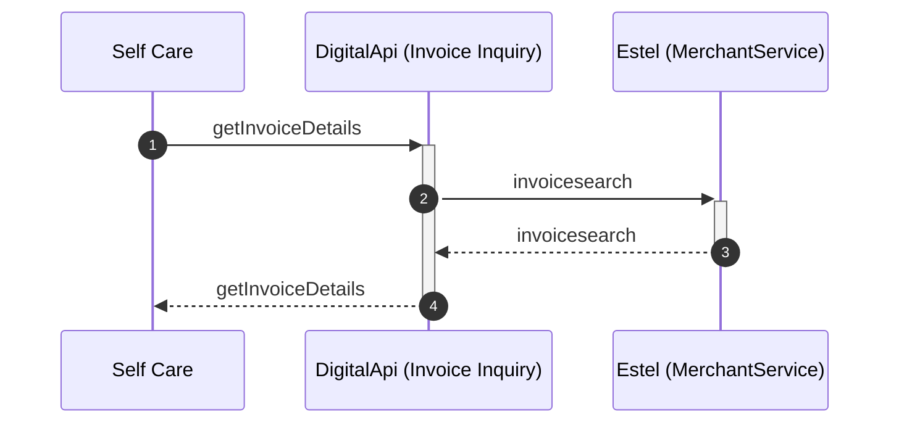

# Invoice Inquiry

## getInvoiceDetails

| Service Characteristics | Values |
| --- | --- |
| **Service Name** | Invoice Inquiry |
| **Operation Name** | getInvoiceDetails |
| **Provider** | Estel |
| **Consumer** | <ul style="list-style-type: disc;"><li>MyJio</li><li>Self Care</li></ul> |
| **Data Format** | Reliance SID |
| **Protocol / Transport** | <ul style="list-style-type: disc;"><li>JSON/HTTP</li><ul style="list-style-type: circle;padding-left: 15px;"><li>MyJio</li><li>Self Care</li></ul></ul> |
| **Mediation Pattern** | Service Translator |
| **Interaction Type** | Synchronous read request |

### Interaction Diagram

Following is a textual walk-through of the Invoice Inquiry – getInvoiceDetails operation.

1.  Service Consumer (e.g. Self Care) invokes getInvoiceDetails operation of Invoice Inquiry service for retrieving the transaction details to generate the invoice.

2.  Invoice Inquiry component translates the request from CMM (Reliance SID) to the proprietary message model of Estel and invokes the invoicesearch operation of the MerchantService web service (Transport / Protocol = SOAP/HTTP).

3.  On receiving response from Estel, Invoice Inquiry component translates the message from the proprietary message model of Estel to the CMM (Reliance SID) and returns the response to the invoking component.

## **Additional details**
[Refer to mapping sheet for list of data elements](https://jio.ril.com/sites/systems/design/Shared%20Documents/04.%20E2E%20Architecture%20and%20Solutions/02.%20Macro%20Design%20Documents/Functional%20Mappings/InvoiceInquiry.xls?Web=1)  
[Refer to Developer Portal for specifications](https://digitalapi.developers.jio.com/api/156)

### Change log

